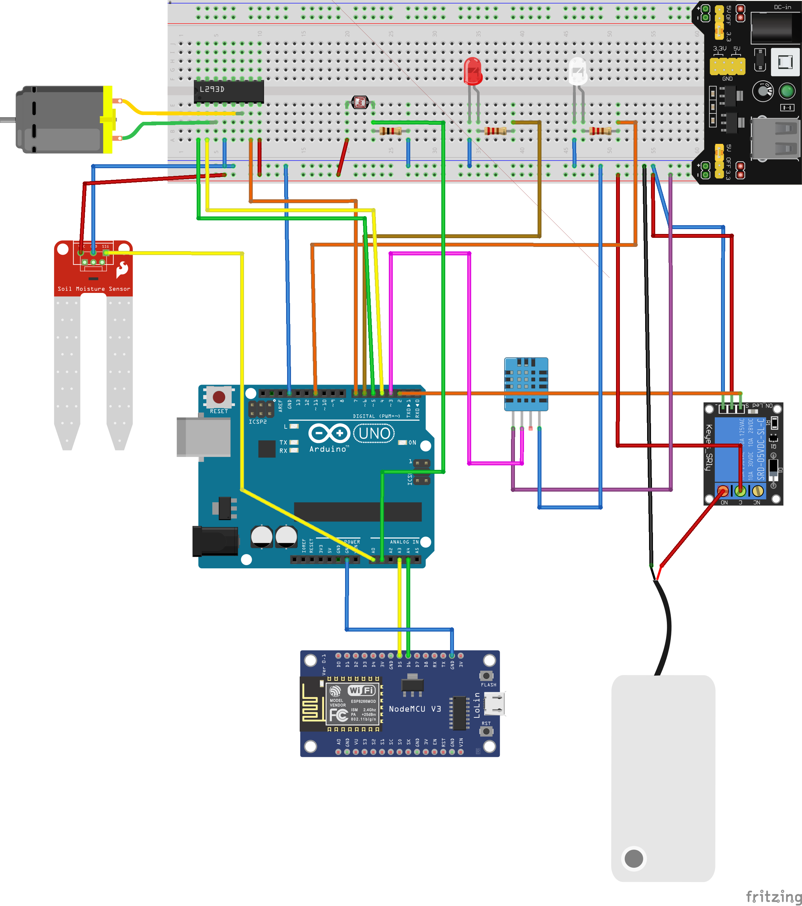
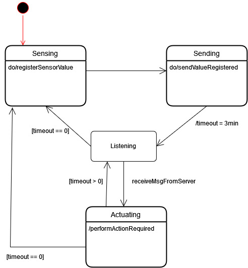
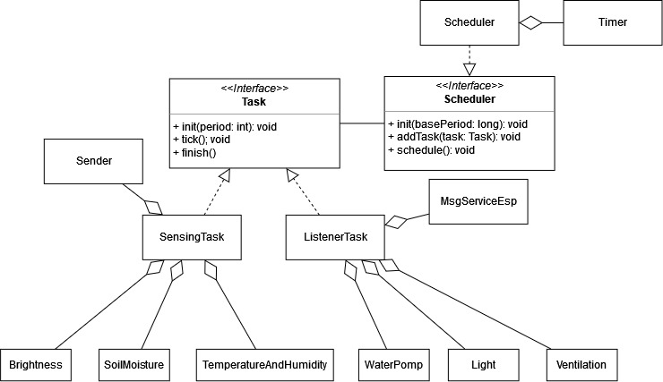
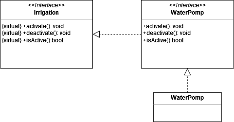
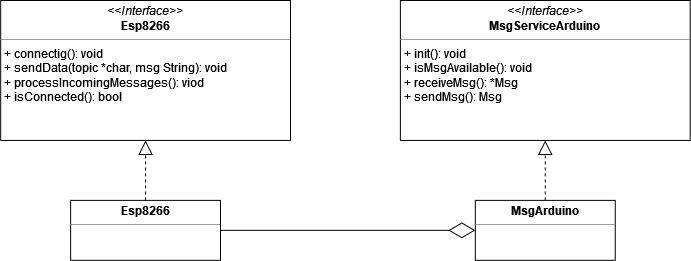
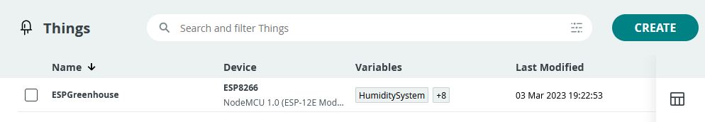
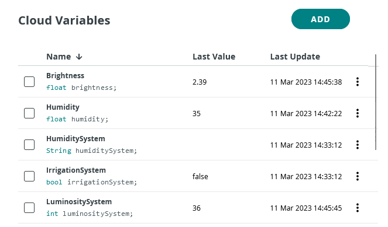
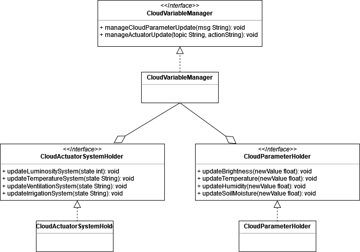
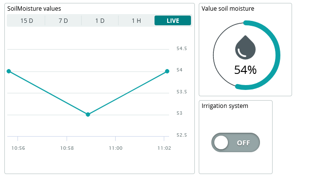

# Sistema di automazione

Il sistema di automazione per la serra intelligente è costituito da due componenti principali: il primo, basato su Arduino, si occupa della gestione dei vari sensori e attuatori presenti nella serra. Il secondo, basato sulla scheda NodeMCU Esp8266, si occupa della comunicazione via rete per permettere il monitoraggio e il controllo a distanza.

Lo schema del collegamento del circuito è visibile nella <a href="#fig1">figura 1</a>.

 
[Fig 1] Schema circuito Arduino

Analizzando le funzionalità che deve svolgere il sistema di automazione, sono stati identificati tre principali moduli, da cui ne deriva l'architettura:

- **Modulo di rilevazione dei valori**, è costituito dai sensori presenti all'interno della serra quali: la fotoresistenza, il sensore di temperatura e umidità e il sensore di umidità del suolo. Questi sensori raccolgono i dati ambientali all'interno della serra e li inviano al modulo di comunicazione;
- **Modulo di esecuzione delle operazioni**, si occupa di eseguire le operazioni richieste dal sistema per correggere i valori rilevati e mantenere le condizioni ambientali ottimali all'interno della serra. È costituito dai moduli di correzione quali: la lampada, la lampada termica, la pompa dell'acqua e il sistema di ventilazione;
- **Modulo di comunicazione**, è rappresentato dalla scheda NodeMCU con relativo modulo WiFi, e svolge il ruolo di intermediario per lo scambio di messaggi tra il sistema di automazione e il backend via rete.

## Architettura a super-loop

L'architettura del sistema di automazione per la serra, utilizza una struttura a **super loop**, che prevede una prima fase di inizializzazione e una successiva di esecuzione di un ciclo a ripetizione continua.

Per capire meglio il comportamento seguito dal sistema durante il ciclo continuo, è possibile fare riferimento alla seguente <a href="#fig2">figura 2</a>, che mostra un diagramma degli stati il quale descrive il comportamento seguito da Arduino:

- **Sensing**, rappresenta lo stato in cui il sistema si occupa di raccogliere i valori rilevati dai sensori;
- **Sending**, una volta registrati i diversi valori dei sensori questi vengono inviati all'ESP;
- **Listening**, è lo stato in cui il sistema è in ascolto di eventuali messaggi provenienti dal Server ed inoltrati dall'ESP, che richiedono l'attivazione o disattivazione di particolari sistemi;
- **Actuating**, rappresenta lo stato in cui il sistema si occupa di effettuare l'operazione richiesta.

 
[Fig 2] Diagramma degli stati: comportamento sistema Arduino

## Desigin di dettaglio

La struttura principale del sistema di Arduino è gestita da uno `Scheduler` che controlla l'esecuzione dei diversi _task_, come rappresentato dalla <a href="#fig3">figura 3</a>. I _task_ del sistema Arduino sono due: `SensingTask`, che si occupa di rilevare i valori dai sensori e `ListenerTask`, che si mette in ascolto delle richieste sulle diverse operazioni da compiere. 

 
[Fig 3] Diagramma delle classi: Task e Scheduler

Per la realizzazione e programmazione dei diversi sensori, cercando di adottare i principi del Domain Driven Design, si è deciso di associare un'interfaccia generica ai diversi sensori e attuatori, che rappresentasse il parametro di riferimento e di implementare tale interfaccia mediante la classe specifica, che rappresenta il componente hardware.

Per capire meglio questo concetto, possiamo fare riferimento alla seguente figura (<a href="#fig4">figura 4</a>), che ci mostra il diagramma delle classi relativo alle componenti necessarie per regolare l'irrigazione.

 
[Fig 4] Diagramma delle classi: sistema di irrigazione

In questo caso, abbiamo un'interfaccia generica `Irrigation` che determina quali sono i metodi che un sistema di irrigazione dovrebbe implementare; il nostro sistema di irrigazione, per il momento, è costituito da un pompa ad acqua, di conseguenza, l'interfaccia `WaterPomp` estende l'interfaccia generica `Irrigation` ereditando i suoi metodi ed infine, l'implementazione dell'interfaccia `WaterPomp` è effettuata dall'omonima classe.

L'architettura che è stata adottata, quindi, ci consente non solo di inserire i termini dell'ubiquitous language in modo efficacie all'interno del codice, ma ci dà anche la possibilità di aggiungere ulteriori sistemi di irrigazione in modo indipendente da quelli già esistenti. Nel caso il sistema dovesse evolversi, risulterà essere molto semplice andare ad apporre le modifiche di aggiunta o rimozione di un componente, all'interno della serra.

Per quanto riguarda la struttura del sistema basato sulla scheda NodeMCU, esso è progettato per gestire la comunicazione tra il sistema Arduino e il backend. Utilizza la comunicazione seriale per interfacciarsi con Arduino e il **protocollo MQTT** per comunicare con il backend. Ogni volta che vengono rilevati nuovi valori da parte dei sensori su Arduino, essi vengono inviati al backend attraverso il protocollo MQTT pubblicando messaggi su un argomento specifico. Il backend elabora i valori ricevuti e, se necessario, invia le operazioni che devono essere compiute dagli attuatori.

Nella seguente figura (<a href="#fig5">figura 5</a>) è possibile vedere le due componenti principali del sistema di comunicazione, che sono: 

- **Esp8266**, la quale si occupa della connessione al _broker_ MQTT e dell' invio e ricezione dei massaggi ad Arduino;
- **MsgServiceArduino**, rappresentante la componente che viene utilizzata dal sistema per comunicare con Arduino attraverso il bus seriale.

 
[Fig 5] Diagramma delle classi: Esp8266 e MsgServiceArduino

## Componenti Cloud

Per la realizzazione del progetto relativo all'ESP, si è deciso di utilizzare la piattaforma **Arduino Cloud**. Le funzionalità principali che questa piattaforma offre, sono le seguenti:

- **Data Monitoring**, consente di monitorare i dati relativi ai sensori di Arduino attraverso apposite dashboard;
- **Variable Synchronisation**, offre la possibilità di sincronizzare variabili fra i diversi dispositivi, abilitando la comunicazione fra questi scrivendo una quantità minima di codice;
- **Scheduler**, consente di schedulare diversi job attivandoli o disattivandoli per un certo quantitativo di tempo;
- **Over-The-Air-Uploads**, consente il caricamento di codice su dispositivi che non sono connessi al computer;
- **Webhooks**, da la possibilità di integrare il progetto con altri servizi, come ad esempiop _IFTTT_
- **Amazon Alexa Support**, consente di introdurre nel prorpio progetto il controllo vocale di _Amazon Alexa_;
- **Dashboard Sharing**, consente di condividere i prorpi dati con altre persone sparse nel mondo.

Per poter utilizzare Arduino Cloud, è necessario iscriversi alla piattaforma, una volta fatto questo è possibile registrare diverse "_Things_", che si vogliono programmare, nel nostro caso si è proceduto alla registrazione dell'ESP relativa alla serra.

 
[Fig 6] Things Arduino Cloud

Una volta creata la rporia "_Thing_" e impostato i parametri necessari per il Cloud, è possibile associare ad essa delle variabili Cloud, le quali danno la possibilità di: registrare, modificare e visionare i valori attraverso la piattaforma. 

 
[Fig 7] Variables Arduino Cloud

Nel nosro caso sono stare specificate otto varibili, quattro di sola lettura riferite ai parametri rilevati dai sensori e quattro riferite ai sistemi di attuazione alle quali è possibile accedere sia in lettura che in scrittura.

Per poter gestire al meglio i componenti del Cloud sono state create tre nuove classi (<a href="#fig8">figura 8</a>) : 

- `CloudVariableManager`, il quale si occupa di mantenre riferimento ai due diversi componenti che si occupano di gestire le variabili relative ai parametri e quelle relative ai sistemi di attuazione;
- `CloudParameterHolder`, che si occupa di gestire l'aggiornamento delle variabili relative ai parametri quando vengono notificati dei nuovi dati;
- `CloudActuatorSystemHolder`, il quale invece si occupa di aggiornare lo stato delle variabili relative ai sistemi di attuazione, ogni qual volta una nuova operazione viene compiuta.

 
[Fig 8] Diagramma delle classi: componenti cloud per la gestione delle variabili

Infine, come detto precedentemente, una funzionalità molto utile di Arduino Cloud, consiste nella possibilità di creare delle dashboard (<a href="#fig9">figura 9</a>) , con cui poter agire e visionare le variabili salvate, quindi per poter visualizzare i valori registrati per la serra e poter agire sui sistmei di attuazione presenti in essa è stata creata un'apposita dashboard, che contiene per ogni parametro tre elementi che consentono di visionare il valore attuale registrato e di agire sul sistema di attuazione.

 
[Fig 9] Elementi dashboard parametro umidità

Ai diversi elementi della dashboard, quindi, è possibile associare una variabile e sfruttare le caratteristihe del elemento stesso per visionarne i dettagli o modificarne lo stato.

