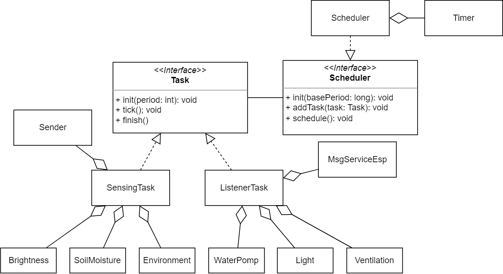
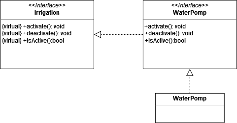

# Sistema di automazione

Il sistema di automazione per la serra intelligente è costituito da due componenti principali: il primo, basato su Arduino, si occupa della gestione dei vari sensori e attuatori presenti nella serra. Il secondo, basato sulla scheda NodeMCU Esp8266, si occupa della comunicazione via rete per permettere il monitoraggio e il controllo a distanza.

Lo schema del collegamento del circuito è visibile nella <a href="#fig1">figura 1</a>.

 
[Fig 1] Schema circuito Arduino

Analizzando le funzionalità che deve svolgere il sistema di automazione, sono stati identificati tre principali moduli, da cui ne deriva l'architettura:

- **Modulo di rilevazione dei valori**, è costituito dai sensori presenti all'interno della serra quali: la fotoresistenza, il sensore di temperatura e umidità e il sensore di umidità del suolo. Questi sensori raccolgono i dati ambientali all'interno della serra e li inviano al modulo di comunicazione;
- **Modulo di esecuzione delle operazioni**, si occupa di eseguire le operazioni richieste dal sistema per correggere i valori rilevati e mantenere le condizioni ambientali ottimali all'interno della serra. È costituito dai moduli di correzione quali: la lampada, la lampada termica, la pompa dell'acqua e il sistema di ventilazione;
- **Modulo di comunicazione**, è rappresentato dalla scheda NodeMCU con relativo modulo WiFi, e svolge il ruolo di intermediario per lo scambio di messaggi tra il sistema di automazione e il backend via rete.

L'architettura del sistema di automazione per la serra, utilizza una struttura a **super loop**, che prevede una prima fase di inizializzazione e una successiva di esecuzione di un ciclo a ripetizione continua.

La struttura principale del sistema di Arduino è gestita da uno `Scheduler` che controlla l'esecuzione dei diversi _task_, come rappresentato dalla <a href="#fig2">figura 2</a>. I _task_ del sistema Arduino sono due: `SensingTask`, che si occupa di rilevare i valori dai sensori e `ListenerTask`, che si mette in ascolto delle richieste sulle diverse operazioni da compiere. 

 
[Fig 2] Diagramma delle classi: Task e Scheduler

Per la realizzazione e programmazione dei diversi sensori, cercando di adottare i principi del Domain Driven Design, si è deciso di associare un'interfaccia generica ai diversi sensori e attuatori, che rappresentasse il parametro di riferimento e di implementare tale interfaccia mediante la classe specifica, che rappresenta il componente hardware.

Per capire meglio questo concetto, possiamo fare riferimento alla seguente figura (<a href="#fig3">figura 3</a>), che ci mostra il diagramma delle classi relativo alle componenti necessarie per regolare l'irrigazione.

 
[Fig 3] Diagramma delle classi: sistema di irrigazione

In questo caso, abbiamo un'interfaccia generica `Irrigation` che determina quali sono i metodi che un sistema di irrigazione dovrebbe implementare; il nostro sistema di irrigazione, per il momento, è costituito da un pompa ad acqua, di conseguenza, l'interfaccia `WaterPomp` estende l'interfaccia generica `Irrigation` ereditando i suoi metodi ed infine, l'implementazione dell'interfaccia `WaterPomp` è effettuata dall'omonima classe.

L'architettura che è stata adottata, quindi, ci consente non solo di inserire i termini dell'ubiquitous language in modo efficacie all'interno del codice, ma ci dà anche la possibilità di aggiungere ulteriori sistemi di irrigazione in modo indipendente da quelli già esistenti. Nel caso il sistema dovesse evolversi, risulterà essere molto semplice andare ad apporre le modifiche di aggiunta o rimozione di un componente, all'interno della serra.

Per quanto riguarda la struttura del sistema basato sulla scheda NodeMCU, esso è progettato per gestire la comunicazione tra il sistema Arduino e il backend. Utilizza la comunicazione seriale per interfacciarsi con Arduino e il **protocollo MQTT** per comunicare con il backend. Ogni volta che vengono rilevati nuovi valori da parte dei sensori su Arduino, essi vengono inviati al backend attraverso il protocollo MQTT pubblicando messaggi su un argomento specifico. Il backend elabora i valori ricevuti e, se necessario, invia le operazioni che devono essere compiute dagli attuatori.

Nella seguente figura (<a href="#fig4">figura 4</a>) è possibile vedere le due componenti principali del sistema di comunicazione, che sono: 

- **Esp8266**, la quale si occupa della connessione al _broker_ MQTT e dell' invio e ricezione dei massaggi ad Arduino;
- **MsgServiceArduino**, rappresentante la componente che viene utilizzata dal sistema per comunicare con Arduino attraverso il bus seriale.

 
[Fig 4] Diagramma delle classi: Esp8266 e MsgServiceArduino

