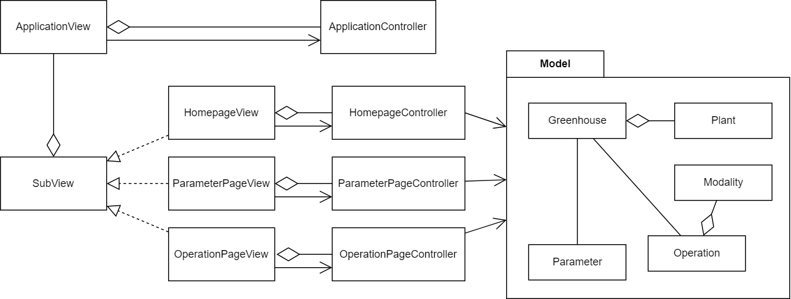

# Client Desktop

Per realizzare il client Desktop si è deciso di utilizzare il pattern architetturale MVC (Model-View-Controller), il quale consente di separare la logica di presentazione dei dati dalla logica di business, al fine di rendere quanto più possibile indipendenti i diversi moduli che lo costituiscono.

Nello specifico, il funzionamento del pattern MVC è il seguente:

-   il **Model** cattura il comportamento dell’applicazione, indipendentemente dall'interfaccia utente, e fornisce i metodi per poter accedere ai dati;
-   il **Controller** riceve i comandi dell’utente attraverso la View e reagisce modificando lo stato dei componenti View e Model;
-   la **View** visualizza i dati contenuti nel Model e si occupa dell’interazione con gli utenti, notificando il Controller.

Il Client Desktop si compone di tre schermate: la homepage, il dettaglio di un parametro e il riepilogo delle operazioni svolte. Come viene mostrato nella <a href="#fig1"> figura 1</a>, l’architettura è composta da una View e un Controller principale: `ApplicationView` e `ApplicationController` che gestiscono le componenti comuni alle diverse pagine dell’applicazione. Ogni pagina dell’applicazione viene vista come una `SubView`, per cui le classi dei componenti `HomepageView`, `ParameterPageView` e `OperationPageView` implementano l’interfaccia `SubView`. Ognuno di questi componenti ha un proprio Controller associato che gestisce la logica specifica di ogni schermata. I vari Controller utilizzano i dati del Model per tenere
aggiornata la View.

 
[Fig 1] Architettura dell’applicazione Desktop

## Tactical design

Il Model fornisce una rappresentazione dei dati della serra, rendendo più facile l’accesso e la gestione di questi dati da parte dei Controller del sistema. In particolare, è costituito dalle seguenti entità del dominio:

- `Greenhouse`, che rappresenta la serra che si vuole gestire ed è composta dalla pianta che è associata alla serra;
- `Plant`, che rappresenta la pianta coltivata della serra, contiene le informazioni della pianta e i suoi valori ottimali per la crescita;
E dai seguenti value objects:
- `PlantParameter`, che rappresenta uno dei parametri monitorati per la pianta;
- `Parameter`, che rappresenta i parametri registrati nella serra e ne tiene traccia per lo storico;
- `Operation`, che rappresenta le operazioni eseguite sulla serra, sia con la modalità automatica sia manuale.
