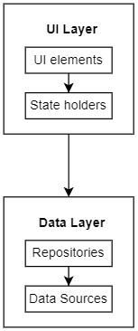
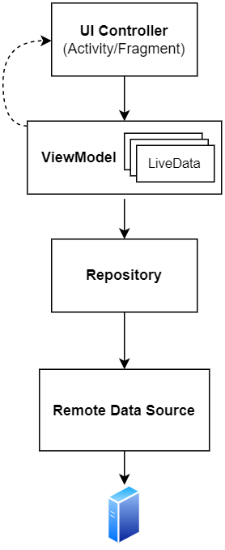

# Client Mobile

Un’applicazione Android è composta da più componenti che possono essere: `Activity`, `Fragment`, `Service`, `Content Provider` e `Broadcast Receiver`. Gli utenti spesso interagiscono con più app in un breve periodo di tempo e il sistema operativo potrebbe distruggere alcuni processi per liberare le risorse e fare spazio a quelli nuovi. È possibile che i componenti dell’applicazione vengano avviati in ordine diverso o che il sistema operativo possa distruggerli in qualsiasi momento. Quindi non si dovrebbe conservare nei componenti dell’applicazione i dati e lo stato dell’applicazione. Considerando tutto ciò, l’architettura deve essere progettata in modo da separare al meglio gli aspetti dell’interfaccia con la logica e la gestione dei dati dell’applicazione.

*Android Developers* consiglia di separare i concetti in due livelli principali: il livello dell’interfaccia utente **UI Layer** e il livello dei dati **Data Layer**, come raffigurato nella <a href="#fig1">figura 1</a>. Il livello dell’interfaccia utente si occupa di visualizzare i dati dell’applicazione sullo schermo e di gestire l’interazione con l’utente.
Questo livello comprende:

-   **UI elements**, ovvero tutto ciò che viene visualizzato dall'utente e con cui può interagire.
-   **State holders**, mantengono lo stato e la logica correlata all’interfaccia utente e si occupano di richiedere il caricamento dei dati necessari per la visualizzazione.

Il livello dei dati, invece, contiene tutte le informazioni dell’applicazione ed è costituito da un insieme di *repositories* che possono includere dei *data sources*:

-   **Repositories** si occupano di estrarre i dati dai *data sources* per poi esporli al resto dell’applicazione.
-   **Data Sources** rappresentano l’origine dei dati. Questi possono essere in remoto, ovvero richiesti dalla rete, oppure in locale, per esempio memorizzati in un database locale. Queste classi vengono utilizzate solo dai *repositories*, per rendere i moduli indipendenti.

 
[Fig 1] Livelli principali dell’applicazione Mobile

L’applicazione Mobile è stata progettata seguendo gli aspetti appena descritti utilizzando il pattern architetturale **MVVM**, ovvero *Model-View-ViewModel*. Questa architettura è una variante del pattern MVC (Model-View-Controller), infatti consente di separare gli aspetti dell’interfaccia grafica dalla logica del dominio, ma è progettato appositamente per semplificare la programmazione basata su eventi delle interfacce utente. In questo modo l’interfaccia non deve occuparsi della logica e grazie all’indipendenza delle varie componenti, è possibile rinnovare l’interfaccia senza modificarne il comportamento. Le principali componenti dell’architettura sono:

-   **Model**, rappresenta il dominio dell’applicazione e il punto di accesso ai dati, quindi gestisce la logica dell’applicazione e di elaborazione dei dati. Comprende quindi il livello dei dati rappresentato dai *repositories* e dai *data sources*.
-   **View**, racchiude gli *UI Elements*, rappresenta quindi la User Interface con cui l’utente interagisce, si occupa di visualizzare i dati e di ricevere le interazioni dell’utente.
-   **ViewModel**, è rappresentato dagli *State holders*, fungono da centro di comunicazione tra il Model e la View, infatti interagiscono con il Model richiedendo i dati necessari alla View.

Riassumendo, la struttura utilizzata nell’applicazione è raffigurato nella <a href="#fig2">figura 2</a>.

 
[Fig 2] Struttura dell'applicazione Mobile

L’applicazione Mobile è composta da più pagine, e quindi ha più interfacce, ognuno di queste è rappresentata da un **layout** definito con il linguaggio `XML` e una classe `UI Controller` associata rappresentata dalle Activity o dai Fragment. Un’Activity è l’*entry point* per l’interazione tra l’applicazione e l’utente, è il componente associato all’interfaccia che consente di gestire gli elementi della pagina. Un’Activity può contenere più interfacce, detti Fragment. Gli Activity e i Fragment hanno un proprio ciclo di vita, ed è possibile sapere in che fase di questo ciclo di vita ci troviamo.

I **ViewModel** gestiscono i dati relativi all’interfaccia utente in modo consapevole rispetto al ciclo di vita. I ViewModel contengono più **LiveData**, ovvero classi contenitori di dati che possono essere osservate quando i dati vengono cambiati. In questo modo, i componenti dell’interfaccia utente, vengono notificati se i dati sono cambiati e possono aggiornarsi di conseguenza.

Successivamente, abbiamo i **Repository**, dei componenti progettati seguendo il pattern *Repository*. È un pattern che ci permette di astrarre l’accesso ai dati, nascondendo la loro effettiva implementazione e tecnologia di persistenza dal modello dell'applicazione. Questo significa che i `ViewModel` possono utilizzare i `Repository` per accedere ai dati di cui hanno bisogno, senza dover conoscere la logica e il modo in cui vengono recuperati i dati. 

Il `Repository`, come detto precedente, si occupa di recuperare i dati dalle varie sorgenti e nel nostro caso, sono richiesti da remoto, ovvero dalla rete tramite le rotte esposte dal Server. Ogni sorgente di dati è rappresentato con una entità **Remote Data Source**.

La nostra applicazione è costituita da un'`Activity` (`MainActivity`) e due `Fragment` (`HomePageFragment` e `ManualControlFragment`), per capire meglio i concetti spiegati precedentemente e l’architettura generale si può osservare il seguente diagramma delle classi ( <a href="#fig3">figura 3</a>), il quale mostra gli elementi necessari per la gestione della homepage:

 
[Fig 3] Diagramma delle classi: Homepage applicazione Mobile

La classe `HomepageFragment` estende dal componente `Fragment` di Android e rappresenta la View della pagina che si occupa di mostrare all’operatore lo stato dei parametri e alcune informazioni della serra.

Per gestire un insieme di elementi in modo semplice ed efficiente si è fatto uso del componente **RecyclerView** di Android. Infatti, basta definire l’aspetto di ogni elemento e la libreria RecyclerView crea dinamicamente gli elementi quando necessario; quindi si è creata una classe `HomepageParameterAdapter` che si occupa di gestire il layout e il comportamento specifico di ogni parametro da visualizzare. Tale classe estende dall'`Adapter` base di Android prendendo come input un `HomepageParameterViewHolder` che contiene i riferimenti ai componenti della View.

Per la gestione della logica della View e i dati relativi alla serra si è fatto uso della classe `GreenhouseViewModel`. Tale classe contiene il riferimento alla serra e ai parametri monitorati e si occupa di richiedere i dati necessari alla View richiamando la classe `GreenhouseRepository`, la quale richiede e riceve i dati necessari tramite la classe `GreenhouseRemoteDataSource`, che si occupa di
effettuare le richieste al Server e di gestire le risposte.
