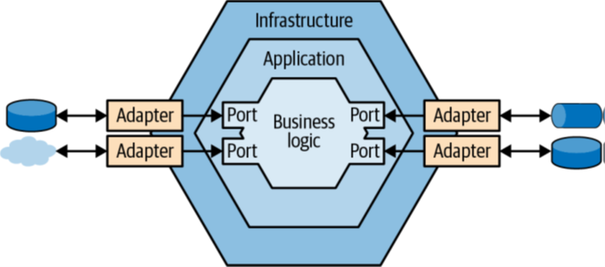
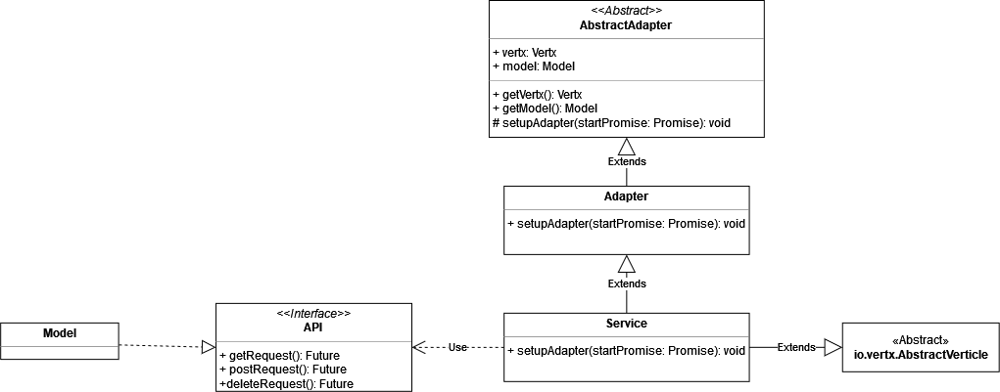
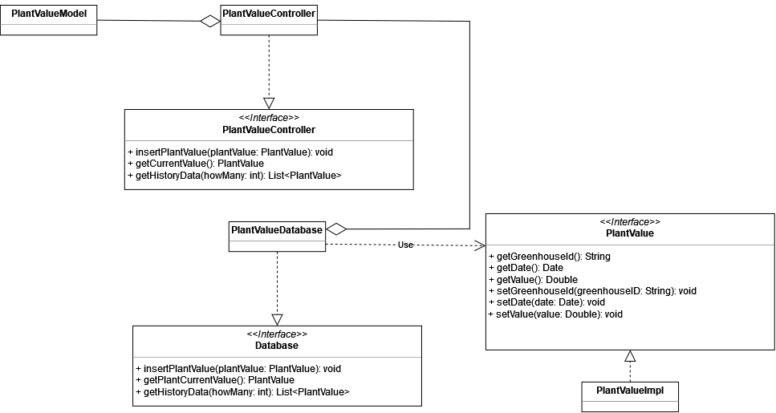
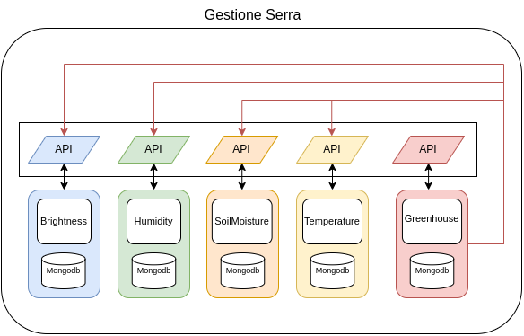

# Sistema di backend

Una volta individuati i bounded context presenti all'interno del sistema di backend, rappresentato da Greenhouse core, è necessario individuare una strategia di integrazione tale per cui i bounded context al suo interno siano il più autonomi possibili; solo in questo modo si possono evitare ad esempio dei rallentamenti o indisponibilità del sistema. A seguito dell'analisi dei requisiti e considerando l'autonomia dei bounded context, si è quindi scelto di realizzare un'architettura a micro-servizi, la quale porta con se diversi vantaggi, come: l'isolamento dagli errori a singoli componenti del sistema, una maggiore scalabilità, semplicità nel deployment etc.

[Fig 1] Architettura esagonale

Come detto precedentemente, nell'introduzione del Design, sono stati individuati otto micro-servizi: ClientCommunication, GreenhouseCommunication, Greenhouse, Operation, Brightness, Humidity, SoilMoisture e Temperature.

Ogni micro-servizio, al fine sempre di ricercare la massima autonomia e isolamento della logica di dominio, come suggerito dalle linee guida del DDD, è stato realizzato tramite un'architettura **esagonale**, anche chiamata **port and adapters** (<a href="#fig1">figura 1</a>); il che significa che la logica del dominio che questi servizi possono presentare viene isolata dal resto e resa indipendente dalle diverse tecnologie e interfacce che vengono utilizzate. Tale autonomia è ottenuta grazie anche al **principio di inversione delle dipendenze** applicato al suo interno, secondo cui un livello può dipendere solamente dai livelli sottostanti, non da quelli al di fuori di lui; di conseguenza, la logica di dominio è il livello più interno della nostra architettura e non deve dipendere da nessuno, il livello applicativo è l'unico che può dipendere da esso, mentre il livello infrastrutturale può dipendere sia dal livello applicativo che da quello del dominio. 

I diversi micro-servizi realizzati, come si può vedere nella <a href="#fig2">figura 2</a>, prevedono tutti caratteristiche simili, ossia:

- espongono una ``API``, che indica le operazioni che possono essere richieste al servizio, poi implementate dalla classe ``Model``;
- presentano uno o più _adapters_ incaricati di gestire e filtrare la comunicazione con l'esterno, a seconda del protocollo di comunicazione utilizzato. Nel nostro caso sono stati impiegati MQTT e HTTP;
- racchiudono i diversi _adapters_  e ``Model`` in una classe ``Service``, il cui compito è di effettuare l'installazione degli _adapters_ e rappresentare il servizio che verrà istanziato.

[Fig 2] Diagramma delle classi: struttura generale di un micro-servizio

Da quanto detto prima, quindi, possiamo intuire che il micro-servizio potrà svolgere funzionalità sia di **Server**, al fine di poter ricevere ed accogliere le richieste provenienti dai diversi micro-servizi in esecuzione, che di **Client**, per poter a sua volta inviare richieste ai micro-servizi attivi, con il quale comunica, in modo da riuscire a portare a termine le sue attività. In particolare, la componente Server sarà gestita dalla classe ``Adapter``, mentre la componente Client sarà gestita dalla classe ``Model``.

I micro-servizi: ``Greenhouse``, ``Operation``,``Brightness``, ``Temperature``, ``SoilMoisture`` e ``Humidity``, per riuscire a soddisfare le richieste provenienti dagli altri micro-servizi, interagiscono con un apposito database. Per questo motivo, per questi servizi, oltre alle componenti viste in precedenza, sono state progettate anche le classi che si occupano della persistenza dei dati e delle interazioni con il database.

Per capire meglio la progettazione che è stata fatta possiamo guardare la <a href="#fig3">figura 3</a>, la quale mostra un esempio di come è stata modellata l'interazione con il database, per i servizi che si occupano di monitorare un parametro specifico della pianta.

Come si può vedere, per rendere indipendente il ``Model`` rispetto al livello di persistenza dei dati, viene utilizzato un componente ``PlantValueController``, che svolge la funzione di intermediario fra il ``PlantValueDatabase`` e il ``Model``. Grazie a questa struttura è possibile aggiungere un livello di astrazione, infatti se in futuro si decidesse di cambiare il modello della persistenza dei dati, o di avvalersi di altre tecnologie, queste modifiche non andrebbero ad intaccare il ``Model``, garantendo così il suo funzionamento, anche in caso di modifiche future al livello dei dati. 

``PlantValue``, in questo caso, rappresenta una delle entità del dominio, che viene utilizzata dal livello della persistenza dei dati per poter fornire i dati nel formato corretto a chi lo richiede. 

In conclusione, possiamo dire che questa struttura, ci consente di tenere separati fra loro i diversi livelli dell'architettura esagonale e di mantenere applicato il principio di inversione delle dipendenze.

 
[Fig 3] Diagramma delle classi: esempio progettazione entità e interazioni con il DB

## Tactical design
Per la realizzazione della componente di backend, sono state seguite le linee guida del tactical design, cercando quindi di individuare tra i concetti del dominio quali avessero il ruolo di entità, value objects o domain service.

Per quanto riguarda il micro-servizio **GreenhouseService**: 
- ``Greenhouse``, ricopre il ruolo di entità, ha quindi un proprio identificativo ed è considerato un oggetto mutabile;
- ``Plant``, ricopre anch'esso il ruolo di entità, il suo identificativo è rappresentato dal nome. Per la sua costruzione è stato utilizzato il _pattern builder_, dando la possibilità di costruire l'oggetto in più step, in modo chiaro, consentendo al contempo di verificane le proprietà;
- ``PlantBuilder``, racchiude la strategia utilizzata per creare l'entità ``Plant``, identificandolo quindi come _life cycle pattern_.

Per i micro-servizi **BrightnessService**, **TemperatureService**, **SoilMoistureService** e **HumidityService**, viene  identificato ``PlantValue`` come value object, in quanto racchiude le informazioni di un valore registrato per uno specifico parametro, pertanto viene impiegato come oggetto immutabile.

Infine, il micro-servizio **OperationService**, contiene al suo interno il value object ``Operation``, che come ``PlantValue`` viene impiegato come oggetto immutabile il quale contiene le informazioni relative alle operazioni compiute all'interno della serra.

## Interazione tra i diversi micro-servizi
I diversi micro-servizi, per poter svolgere le loro funzioni hanno la necessità di comunicare e interagire tra loro, per capire quali sono le dinamiche del sistema, almeno ad alto livello, possiamo analizzare le figure <a href="#fig4">4</a> e <a href="#fig5">5</a>. 

In dettaglio la <a href="#fig4">figura 4</a> mostra come avvengono le comunicazioni all'interno del bounded context **Gestione Serra**. Tale bounded context prevede,infatti, la presenza di cinque micro-servizi: Brightness, Humidity, SoilMoisture, Temperature e Greenhouse i quali comunicano tra loro per mezzo delle **API** messe a disposizione da ciascuno. Nello specifico, la comunicazione, come si può vedere in figura, avviene in modo unidirezionale a partire dal servizio ``Greenhouse``, in quanto è quest'ultimo che ha il compito di ricevere i dati rilevati all'interno della serra e delegare poi al rispettivo servizio il compito di storicizzarli.

 
[Fig 4] Interazione dei micro-servizi all'interno di Gestione serra

Nella <a href="#fig5">figura 5</a> è, invece, possibile osservare come avvengono le interazioni tra i microservizi, che compongono i bounded context presenti nel sub-domain **Greenhouse core**. È da notare che in questo caso, sono stati omessi i micro-servizi presenti all'interno del bounded context Gestione serra, al fine di rendere più chiara la rappresentazione.

 
[Fig 5] Interazione dei micro-servizi presenti nel sub domain Greenhouse core

L'interazione in questo caso coinvolgere due fonti distinte: il Client, Desktop o Mobile, oppure il sistema di automazione. Nel primo caso le interazioni che possono avvenire da e verso il client, passano tutte per il servizio ``ClientCommunication``. Nel caso delle richieste effettuate dal Client verso il sistema di backend, il servizio può comunicare con uno dei micro-servizi presenti all'interno del bounded context **Gestione serra**, qualora fosse interessato a reperire le informazioni relative alla serra o ad uno o più dei parametri rilevati, oppure con il servizio ``Operation`` presente all'interno del bounded context **Operation**, qualora fosse interessato a reperire o effettuare un'operazione sulla serra. Per quanto riguarda invece le comunicazioni verso il client, queste possono solo partire dal servizio ``Greenhouse``, le quali passando, come detto, per ``ClientCommunication`` arrivano al Client.

Nel caso, invece, in cui le interazioni coinvolgano il sistema di automazione, tutte le comunicazioni sono mediate dal servizio ``GreenhouseCommunication``, presente all'interno del bounded context **Gestione comunicazione serra**. Tale servizio può comunicare solo con il servizio ``Greenhouse`` al fine di informarlo dei nuovi rilevamenti, mentre può ricevere delle richieste solo dal servizio ``Operation`` il quale lo informa di eseguire una determinata operazione sulla serra, indipendentemente dalla modalità di gestione adottata.

Il servizio ``Operation``, come si può notare in <a href="#fig5">figura 5</a>, può ricevere le richieste sia da ``ClientCommunication``, il quale come detto, può richiedere le informazioni relative alle operazioni o richiederne l'esecuzione di una specifica quando la modalità di gestione è manuale, oppure da ``Greenhouse``, qualora la modalità di gestione fosse automatica e risultasse necessario effettuare un'operazione correttiva.

Di seguito (figure <a href="#fig6">6</a> e <a href="#fig7">7</a>) verrà mostrato un esempio, mediante apposito diagramma, delle interazioni che sono presenti all'interno del sistema; per semplicità e chiarezza espressiva l'esempio considera un solo parametro della pianta da monitorare: la temperatura.

 
[Fig 6] Diagramma delle interazioni: interazione micro-servizi con modalità automatica

La <a href="#fig6">figura 6</a> mostra il caso in cui la serra sia gestita in modo automatico. In queste condizioni il sistema, a seguito del rilevamento di una condizione di allarme o del rientro di quest'ultima sarà incaricato d'intraprendere un'azione correttiva. Nell'esempio in questione i servizi coinvolti sono: 
- ``GreenhouseCommunication``, il quale riceve i dati rilevati dai sensori posti all'interno della serra;
- ``Greenhouse`` che riceve i dati rilevati e verifica se si trovano all'interno dei range ottimali;
- ``Temperature``, il cui compito è quello di salvare le rilevazioni effettuate;
- ``Operation``, il quale nel caso in cui sia necessario svolgere un'operazione correttiva, ne registra le informazioni e ne richiede l'esecuzione;
- ``ClientCommunication``, che si occupa di inviare ai clients tutte le informazioni necessarie al fine di mantenerli sempre aggiornati. 

Come si può vedere dal diagramma (<a href="#fig6">figura 6</a>), l'interazione inizia dal sistema di automazione, il quale non appena vengono rilevati nuovi valori per i parametri li invia al servizio ``GreenhouseCommunication``, che si occupa di inoltrarli al servizio ``Greenhouse``. Quest'ultimo per prima cosa invierà il parametro relativo alla temperatura al servizio ``Temperature``, per il suo salvataggio, successivamente verificherà che il valore registrato non sia critico per la pianta. Se si verifica una situazione di allarme, il servizio ``Greenhouse``, determina l'operazione da intraprendere sulla base del parametro e del tipo di criticità, dopodiché richiederà al sistema di eseguire l'operazione individuata e di storicizzarla tramite l'inoltro di questa al servizio ``Operation`` e infine, si occuperà della sua comunicazione al servizio ``ClientCommunication``, in modo che i Client vengano aggiornati.

Se il sistema, invece, viene gestito tramite la modalità manuale (<a href="#fig7">figura 7</a>) l'interazione è molto simile a quanto visto precedentemente, tuttavia in questo caso non è più il servizio ``Greenhouse`` a decidere l'operazione da intraprendere, ma questa decisione spetterà al Client Mobile. In particolare, il Client Mobile, dopo aver richiesto il controllo manuale, al servizio ``ClientCommunication``, avrà la possibilità di richiedere l'esecuzione di determinate operazioni, le quali verranno sempre inviate al sistema di automazione tramite il servizio ``GreenhouseCommunication``.

 
[Fig 7] Diagramma delle interazioni: interazione micro-servizi con modalità manuale

