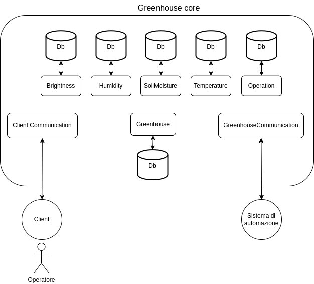

# Design

Come detto precedentemente, le componenti del sistema che si vuole andare a realizzare sono quattro: il sistema di automazione serra, il sistema di backend e le due diverse tipologie di clients: Desktop e Mobile.

Per realizzare il sistema di backend, si è deciso di adottare un'architettura a microservizi. Come è possibile vedere dalla <a href="#fig1">figura 1</a>, sono stati individuati otto microservizi principali:

- **GreenhouseCommunication**, si occupa di gestire le comunicazioni fra il backend e il sistema di automazione (costituito da Arduino e l’ESP);
- **Greenhouse**, il quale detiene le informazioni relative alla serra, tra cui la pianta coltivata al suo interno, i range ottimali per i suoi parametri vitali e la modalità attuale di gestione: manuale o automatica. Questo servizio si occupa, inoltre, di analizzare i diversi dati rilevati dai sensori, in modo da individuare eventuali situazioni di allarme e in tal caso stabilire l’operazione correttiva
da intraprendere;
- **Operation**, è il servizio che detiene e gestisce tutte le operazioni che vengono effettuate all’interno della serra;
- **ClientCommunication**, è il servizio che si occupa di gestire le comunicazioni con i clients. Sostanzialmente informa tutti i clients connessi dello stato della serra e delle operazioni compiute al suo interno e si occupa anche di raccogliere e gestire le loro richieste;
- **Brightness, Humidity SoilMoisture e Temperature** sono tutti servizi che si occupano di salvare i dati raccolti dai sensori per il relativo parametro monitorato e di fornire i dati storici a chi lo richiede.

Dalla <a href="#fig1">figura 1</a> possiamo notare, inoltre, altri tre aspetti principali:

1. Non tutti i microservizi presentano un livello di persistenza dei dati e ogni microservizio che necessita di mantenere salvate delle informazioni, ha accesso a un proprio database in cui poterle memorizzare. Non vi è quindi, alcun tipo di dipendenza che lega la persistenza dei dati fra i diversi microservizi, sono tutti gestiti autonomamente;

2. le funzionalità del sistema di backend sono racchiuse all'interno del sub-domain Greenhouse core;

3. i due servizi individuati come **ClientCommunication** e **GreenhouseCommunication**, rappresentano dei gateway verso i clients e verso il sistema di automazione serra; questo implica che tutte le comunicazioni da e verso i clients, dovranno per forza passare per `ClientCommunication`, mentre tutte le comunicazioni da e verso il sistema di automazione, dovranno passare per forza da `GreenhouseCommunication`. 

 
[Fig 1] Architettura generale

