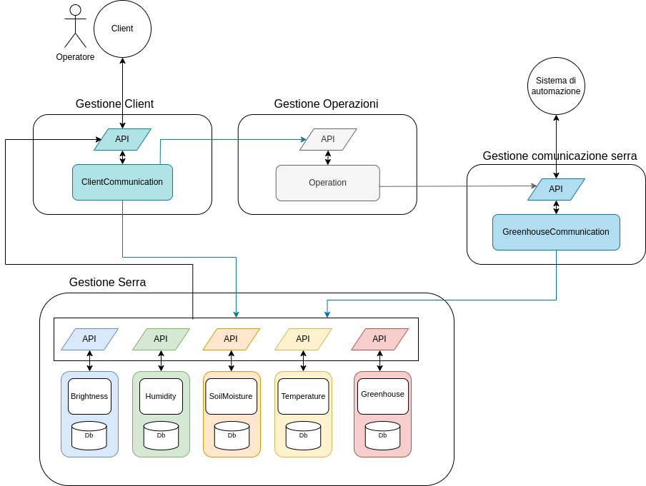

# Sistema di backend

Una volta individuati i bounded context presenti all'interno del sistema di backend, rappresentato da Greenhouse core, è necessario individuare una strategia di integrazione tale per cui i bounded context al suo interno siano il più autonomi possibili; solo in questo modo si possono evitare ad esempio dei rallentamenti o indisponibilità del sistema. A seguito dell'analisi dei requisiti e considerando l'autonomia dei bounded context, si è scelto di realizzare un'architettura a micro-servizi, la quale porta con se diversi vantaggi, come: l'isolamento dagli errori a singoli componenti del sistema, una maggiore scalabilità, semplicità nel deployment etc.

## Architettura a micro-servizi e ports and adapters

Come detto precedentemente, nell'introduzione del Design, sono stati individuati otto micro-servizi: ClientCommunication, GreenhouseCommunication, Greenhouse, Operation, Brightness, Humidity, SoilMoisture e Temperature.

<div align="center">

<p align="center">[Fig 1] Architettura esagonale</p>
</div>

Ogni micro-servizio, al fine di ricercare la massima autonomia e isolamento della logica di dominio, come suggerito dalle linee guida del DDD, è stato realizzato tramite un'architettura **esagonale**, anche chiamata **ports and adapters** (<a href="#fig1">figura 1</a>); il che significa che la logica del dominio che questi servizi possono presentare viene isolata dal resto e resa indipendente dalle diverse tecnologie e interfacce che vengono utilizzate. Tale autonomia è ottenuta grazie anche al **principio di inversione delle dipendenze** applicato al suo interno, secondo cui un livello può dipendere solamente dai livelli sottostanti, non da quelli al di fuori di lui; di conseguenza, la logica di dominio è il livello più interno della nostra architettura e non deve dipendere da nessuno, il livello applicativo è l'unico che può dipendere da esso, mentre il livello infrastrutturale può dipendere sia dal livello applicativo che da quello del dominio.

I diversi micro-servizi realizzati, come si può vedere nella <a href="#fig2">figura 2</a>, prevedono tutti caratteristiche simili, ossia:

- espongono una ``API``, che indica le operazioni che possono essere richieste al servizio, poi implementate dalla classe ``Model``;
- presentano uno o più _adapters_ incaricati di gestire e filtrare la comunicazione con l'esterno, a seconda del protocollo di comunicazione utilizzato. Nel nostro caso sono stati impiegati MQTT e HTTP;
- racchiudono i diversi _adapters_  e ``Model`` in una classe ``Service``, il cui compito è di effettuare l'installazione degli _adapters_ e rappresentare il servizio che verrà istanziato.

<div align="center">

<p align="center">[Fig 2] Diagramma delle classi: struttura generale di un micro-servizio</p>
</div>

Da quanto detto prima, quindi, possiamo intuire che il micro-servizio potrà svolgere funzionalità sia di **Server**, al fine di poter ricevere ed accogliere le richieste provenienti dai diversi micro-servizi in esecuzione, che di **Client**, per poter a sua volta inviare richieste ai micro-servizi attivi, con il quale comunica, in modo da riuscire a portare a termine le sue attività. In particolare, la componente Server sarà gestita dalla classe ``Adapter``, mentre la componente Client sarà gestita dalla classe ``Model``.

I micro-servizi: ``Greenhouse``, ``Operation``,``Brightness``, ``Temperature``, ``SoilMoisture`` e ``Humidity``, per riuscire a soddisfare le richieste provenienti dagli altri micro-servizi, interagiscono con un apposito database. Per questo motivo, per questi servizi, oltre alle componenti viste in precedenza, sono state progettate anche le classi che si occupano della persistenza dei dati e delle interazioni con il database.

Per capire meglio la progettazione che è stata fatta possiamo guardare la <a href="#fig3">figura 3</a>, la quale mostra un esempio di come è stata modellata l'interazione con il database, per i servizi che si occupano di monitorare un parametro specifico della pianta.

Come si può vedere, per rendere indipendente il ``Model`` rispetto al livello di persistenza dei dati, viene utilizzato un componente ``PlantValueController``, che svolge la funzione di intermediario fra il ``PlantValueDatabase`` e il ``Model``. Grazie a questa struttura è possibile aggiungere un livello di astrazione, infatti, se in futuro si decidesse di cambiare il modello della persistenza dei dati, o di avvalersi di altre tecnologie, queste modifiche non andrebbero ad intaccare il ``Model``, garantendo così il suo funzionamento, anche in caso di modifiche future al livello dei dati. 

``PlantValue``, in questo caso, rappresenta una delle entità del dominio, che viene utilizzata dal livello della persistenza dei dati per poter fornire i dati nel formato corretto a chi lo richiede. 

In conclusione, possiamo dire che questa struttura, ci consente di tenere separati fra loro i diversi livelli dell'architettura esagonale e di mantenere applicato il principio di inversione delle dipendenze.

<div align="center">

 <p align="center">[Fig 3] Diagramma delle classi: esempio progettazione entità e interazioni con il DB</p>
</div>

## Dipendenze fra i diversi micro-servizi

I diversi micro-servizi, per poter svolgere le loro funzioni hanno la necessità di comunicare e interagire tra loro, per capire quali sono le dipendenze che li legano, possiamo analizzare le figure sottostanti. 

<div align="center">

 <p align="center">[Fig 4] Dipendenze fra i diversi micro-servizi all'interno di Greenhouse Core</p>
</div>

In dettaglio, la <a href="#fig4">figura 4</a>, mostra quali sono le relazioni che regolano i diversi servizi all'interno del bounded context **Greenhouse Core** e come possiamo notare:

- vi è una dipendenza **monodirezionale**, da `GreenhouseCommunication`, a tutti i diversi servizi dei parametri, in quanto tale servizio si occuperà di comunicare ad ognuno di loro i valori rilevati;
- è presente una relazione **monodirezionale**, fra i diversi servizi dei parametri e `Greenhouse`, in quanto questi si appogiano a tale servizio per poter ottenere informazioni relative ai range ottimali previsti per la pianta e la modalità di gestione;
- vi è una relazione **bidirezionale** fra i servizi dei parametri e `ClientCommunication`, perché quando un nuovo valore viene registrato il Client viene informato per mezzo delle Socket dei servizi e quando il Client è interessato a ricevere i dati storici interroga i diversi servizi;
- vi è una relazione **bidirezionale** fra `ClientCommunication` e `Operation`, in quanto il servizio `Operation` si occupa di aggiornare i clients in relazione alle nuove operazioni compiute dal sistema in modalità automatica, mentre `ClientCommunication` notifica ad `Operation` le operazioni richieste dagli utenti tramite la modalità manuale;
- è presente una relazione **monodirezionale** fra i servizi `Operation` e `GreenhouseCommunication`, in quanto il servizio `Operation` si occupa di notificare a `GreenhouseCommunication` quali sono le operazioni da svolgere sulla serra;
- è presente una relazione **monodirezionale** fra `ClientCommunication` e `Greenhouse`, perché `ClientCommunication` interroga `Greenhouse` per poter ricevere le informazioni relative alla serra. 

Concentrandoci sui micro-servizi che rientrano all'intenro del bounded context **Gestione Serra**, la <a href="#fig5">figura 5</a>, mostra come avvengono le comunicazioni. 

<div align="center">

 <p align="center">[Fig 5] Dipendenze micro-servizi all'interno di Gestione serra</p>
</div>

Il bounded context Gestione Serra prevede, infatti, la presenza di cinque micro-servizi: `Brightness`, `Humidity`, `SoilMoisture`, `Temperature` e `Greenhouse` i quali comunicano tra loro per mezzo delle **API** messe a disposizione da ciascuno. Nello specifico, la comunicazione, come si può vedere in figura, avviene in modo unidirezionale a partire dai servizi dei parametri fino a `Greenhouse`, in quanto ogni servizio ha il compito di gestire in autonomia il parametro ad egli associato e si appoggia su `Greenhouse` solo per avere alcune informazioni relative alla serra.

<div align="center">

 <p align="center">[Fig 6] Dipendenze micro-servizi presenti nel sub domain Greenhouse core</p>
</div>

Nella <a href="#fig6">figura 6</a> è, invece, possibile osservare meglio quali sono le dipendenze tra i micro-servizi, presenti nel sub-domain **Greenhouse core**, in riferimento ai diversi bounded context in cui sono stati inseriti. È da notare, che in questo caso sono state omesse le relazioni fra i micro-servizi presenti all'interno del bounded context Gestione Serra, al fine di rendere più chiara la rappresentazione.


## Interazione tra i diversi micro-servizi

Di seguito (figure <a href="#fig7">7</a> e <a href="#fig8">8</a>) verrà mostrato un esempio, mediante apposito diagramma, delle interazioni che sono presenti all'interno del sistema; per semplicità e chiarezza espressiva l'esempio considera un solo parametro della pianta da monitorare: la temperatura, ma le interazioni che avvengono sono identiche per i diversi parametri.

<div align="center">

 <p align="center">[Fig 7] Diagramma delle interazioni: interazione micro-servizi con modalità automatica</p>
</div>

La <a href="#fig7">figura 7</a> mostra il caso in cui la serra sia gestita in modo automatico. In queste condizioni il sistema, a seguito del rilevamento di una condizione di allarme o del rientro di quest'ultima, sarà incaricato d'intraprendere un'azione correttiva.

Nell'esempio in questione i servizi coinvolti sono: 
- **GreenhouseCommunication**, il quale riceve i dati rilevati dai sensori posti all'interno della serra;
- **Greenhouse**, che detiene le informazioni della pianta coltivata all'intenro della serra e della modalità di gestione di questa, le quali vengono richieste dai servizi dei parametri;
- **Temperature**, che riceve i dati rilevati, verifica se si trovano all'interno dei range ottimali e nel caso non lo siano stabilisce qual'è l'operazione da intraprendere;
- **Operation**, il quale nel caso in cui sia necessario svolgere un'operazione correttiva, ne registra le informazioni e ne richiede l'esecuzione;
- **ClientCommunication**, che si occupa di inviare ai clients tutte le informazioni necessarie al fine di mantenerli sempre aggiornati.

Se il sistema, invece, viene gestito tramite la modalità manuale (<a href="#fig8">figura 8</a>) l'interazione è molto simile a quanto visto precedentemente, tuttavia in questo caso non è più il servizio ``Temperature`` a decidere l'operazione da intraprendere, ma questa decisione spetterà al Client Mobile. In particolare, il Client Mobile, dopo aver richiesto il controllo manuale, al servizio ``ClientCommunication``, avrà la possibilità di richiedere l'esecuzione di determinate operazioni, le quali verranno sempre inviate al sistema di automazione tramite il servizio ``GreenhouseCommunication``.

<div align="center">

 <p align="center">[Fig 8] Diagramma delle interazioni: interazione micro-servizi con modalità manuale</p>
</div>

Osservando i diagrammi di interazione possiamo notare che:

- le interazioni che possono avvenire da e verso il Client, passano tutte per il servizio ``ClientCommunication``; 
    - il servizio può comunicare con uno dei micro-servizi presenti all'interno del bounded context **Gestione serra**, qualora fosse interessato a reperire le informazioni relative alla serra o ad uno o più dei parametri rilevati, oppure con il servizio ``Operation`` presente all'interno del bounded context **Operation**, qualora fosse interessato a reperire o effettuare un'operazione sulla serra.
- Nel caso, in cui le interazioni coinvolgano il sistema di automazione, tutte le comunicazioni sono mediate dal servizio ``GreenhouseCommunication``, 
    - il servizio può ricevere delle richieste solo da ``Operation`` il quale lo informa di eseguire una determinata operazione sulla serra, indipendentemente dalla modalità di gestione adottata.

## API dei diversi micro-servizi
Come detto precedentemente, al fine di rispettare l'architettura esagonale, ogni micro-servizio espone delle API attraverso gli _adapters_ in modo tale che le sue funzionalità possano essere utilizzate dai clients del servizio. 

Per quanto riguarda gli _adapters_ HTTP si è deciso di esporre le funzionalità dei servizi aderendo alle linee guida delle _API REST_, per cui le risorse saranno identificate da un _HTTP URI_; per accedere alle risorse e trasferirle si utilizzeranno i metodi predefiniti e come codifica di invio dei dati si utilizzerà il formato JSON. 

Per osservare le API dei servizi con maggior dettaglio è possibile consultare la documentazione [OpenAPI](https://app.swaggerhub.com/apis/ANNAVITALI4/SmartGreenhouseServer/1.0.0) prodotta. 

### Greenhouse Communication Service
Si occupa di gestire le comunicazioni fra il backend e il sistema di automazione (costituito da Arduino e l’ESP); per fare questo è dotato di due _adapters_: il primo MQTT, utilizzato per comunicare con il microcontrollore e il secondo HTTP per ricevere le richieste dagli altri servizi presenti all'interno del sistema di backend.


**API MQTT**

Viene utilizzato il topic `dataSG` per ricevere i dati dal microcontrollore nel formato:

```json
{
    "id":"greenhouse1",
    "topic": "Temp", 
    "value": 10.5
}
```

Dove `id` rappresenta l'id della serra in cui è posizionato il sensore, `topic` rappresenta il parametro di cui viene notificata la rilevazione e `value` per indicare il valore rilevato dal sensore.


Il servizio, di conseguenza, riceverà i dati relativi al topic `dataSG` e procederà ad inoltrarli al servizio incaricato di gestire i valori del parametro; ad esempio se viene rilevato un nuovo valore per la temperatura `GreenhouseCommunication` inoltrerà, il messaggio al servizio `Temperature`.

**API HTTP**

Vengono impiegate dagli altri servizi per delegare a `GreenhouseCommunication` il compito di comunicare al microcontrollore una determinata azione correttiva, come ad esempio la richiesta di accendere o spegnere una lampada. Le _root_ esposte dal servizio sono:

- `/greenhouseCommunication/brightnessOperation`, utilizzata per comunicare sul topic `LUMINOSITY` incaricato di gestire gli attuatori per la luminosità;
- `/greenhouseCommunication/soilMoistureOperation`, utilizzata per comunicare sul topic `IRRIGATION` incaricato di gestire gli attuatori per l'umidità del suolo;
- `/greenhouseCommunication/humidityOperation`, utilizzata per comunicare sul topic `VENTILATION` incaricato di gestire gli attuatori per l'umidità dell'aria;
- `/greenhouseCommunication/temperatureOperation`, utilizzata per comunicare sul topic `TEMPERATURE` incaricato di gestire gli attuatori per la temperatura;

### Greenhouse
Detiene le informazioni relative alla serra, tra cui la pianta coltivata al suo interno, i range ottimali per i suoi parametri vitali e la modalità attuale di gestione: manuale o automatica. 

Le API esposte dal servizio sono:

- `/greenhouse`, che a seconda del metodo utilizzato, GET o PUT, permette di ottenere le informazioni della serra o modificarne la modalità;
- `/greenhouse/all`, permette di ottenere tutte le serre presenti nel sistema;
- `/greenhouse/modality`, per ottenere la modalità di gestione della serra;
- `/greenhouse/param`, permette, dato un parametro, di conoscere il suo range ottimale.

### Operation
È il servizio che detiene e gestisce tutte le operazioni che vengono effettuate all’interno della serra e si occupa di delegare la comunicazione delle operazioni al servizio `GreenhouseCommunication` e a `ClientCommunication` per comunicare ai clients che una nuova operazione correttiva è stata effettuata. 

Le API esposte dal servizio sono:

- `/operations`, per ottenere tutte le operazioni effetuate in una determinata serra o inserirne una nuova, a seconda del metodo scelto, GET o POST;
- `/operations/date`, per ottenere le operazioni effetuate in una determinata serra in un determinato range temporale;
- `/operations/parameter`, per ottenere tutte le operazioni relative ad un parametro effetuate in una determinata serra;
- `/operations/parameter/last`, per ottenere l'ultima operazione relativa ad un parametro effetuata in una determinata serra;

### ClientCommunication
È il servizio che si occupa di gestire le comunicazioni con i clients. Sostanzialmente informa tutti i clients connessi dello stato della serra e delle operazioni compiute al suo interno e si occupa anche di raccogliere e gestire le loro richieste;

Le API esposte dal servizio sono:

- `/clientCommunication/greenhouse`, si occupa di reperire le informazioni relative alla serra;
- `/clientCommunication/greenhouse/all`, si occupa di ottenere tutte le serre presenti all'interno del sistema;
- `/clientCommunication/greenhouse/modality/notify`, si occupa di informare tutti i client che la modalità di gestione di una determinata serra è cambiata;
- `/clientCommunication/greenhouse/modality`, si occupa di modificare la modalità di gestione di una determinata serra;
- `/clientCommunication/parameter`, reperisce o storicizza l'ultimo valore rilevato da un determinato parametro in una specifica serra;
- `/clientCommunication/parameter/history`, reperisce lo storico dei valori rilevati da un determinato parametro presente in una specifica serra;
- `/clientCommunication/operations`, reperisce tutte le operazioni effettuate in una serra o se il metodo è POST ne memorizza una nuova;
- `/clientCommunication/operations/parameter`, reperisce tutte le operazioni relative ad un parametro effettuate in una serra;
- `/clientCommunication/operations/notify`, notifica ai client che è stata effettuata una nuova operazione all'interno di una specifica serra;
- `/clientCommunication/operations/date`, reperisce lo storico, in un range temporale, delle operazioni effettuate in una specifica serra.

### Brightness, Humidity, SoilMoisture e Temperature
Sono tutti servizi che si occupano di gestire i dati raccolti dai sensori per il relativo parametro monitorato, o più in generale, di rappresentare nel web il dispositivo fisico che si occupa di monitorare e gestire uno dei parametri della serra. Per fare ciò si è pensato di utilizzare i moderni **standar web come livello applicativo dell'IoT**, rendendoli di fatto aderenti alla definizione di _Web of Things_ (WoT).

I servizi comunicano con: `GreenhouseService`, per ottenere l'informazione relativa alla modalità di gestione della serra e il range ottimale del parametro che rappresentano, `OperationService `, a cui delegano la storicizzazione ed esecuzione delle operazioni correttive e per ottenere l'informazione relativa all'ultima operazione effettuata, e `ClientCommunication`, al fine di delegare la responsabilità di informare i clients che un nuovo valore è stato rilevato.

Le API esposte dal servizio sono:

- `parameterName`,per ottenere l'ultimo valore rilevato all'interno di una specifica serra o inserirne uno nuovo, a seconda del metodo scelto, GET o POST;
- `parameterName/history`, reperisce lo storico dei valori rilevati da un determinato parametro presente in una specifica serra;
- `parameterName/thing-description`, per ottenere la thing description del servizio.

Dove `parameterName` deve essere sostituito con `brightness`, `humidity`, `soilMoisture` o `temperature` a seconda del parametro su cui si vuole agire.

## Elementi del tactical design
Per la realizzazione della componente di backend, sono state seguite le linee guida del tactical design, cercando quindi di individuare tra i concetti del dominio quali avessero il ruolo di entità, value objects o domain service.

Per quanto riguarda il micro-servizio **GreenhouseService**: 
- ``Greenhouse``, ricopre il ruolo di entità, ha quindi un proprio identificativo ed è considerato un oggetto mutabile;
- ``Plant``, ricopre anch'esso il ruolo di entità, il suo identificativo è rappresentato dal nome. Per la sua costruzione è stato utilizzato il _pattern builder_, dando la possibilità di costruire l'oggetto in più step, in modo chiaro, consentendo al contempo di verificane le proprietà;
- ``PlantBuilder``, racchiude la strategia utilizzata per creare l'entità ``Plant``, identificandolo quindi come _life cycle pattern_.

Per i micro-servizi **BrightnessService**, **TemperatureService**, **SoilMoistureService** e **HumidityService**, viene  identificato ``PlantValue`` come value object, in quanto racchiude le informazioni di un valore registrato per uno specifico parametro, pertanto viene impiegato come oggetto immutabile.

Infine, il micro-servizio **OperationService**, contiene al suo interno il value object ``Operation``, che come ``PlantValue`` viene impiegato come oggetto immutabile il quale contiene le informazioni relative alle operazioni compiute all'interno della serra.
