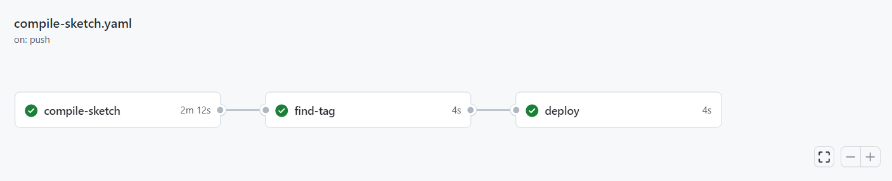
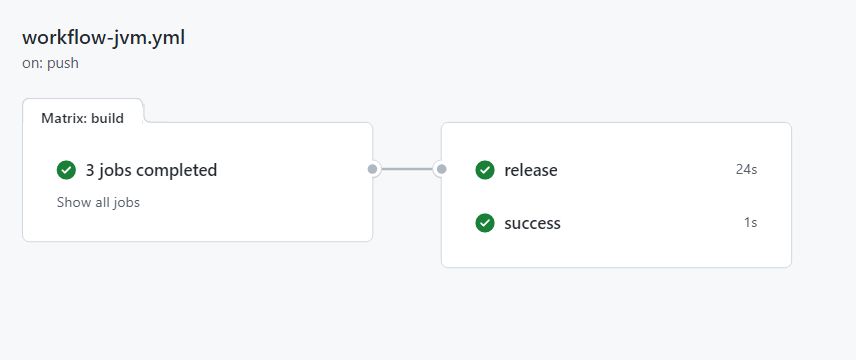
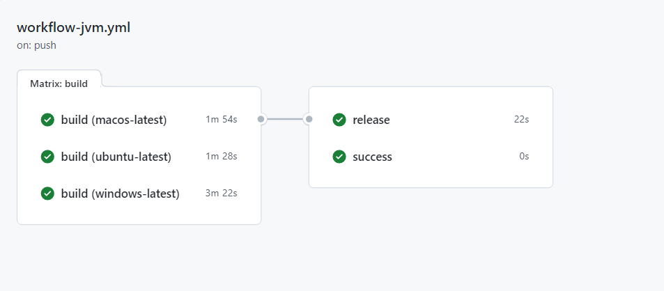
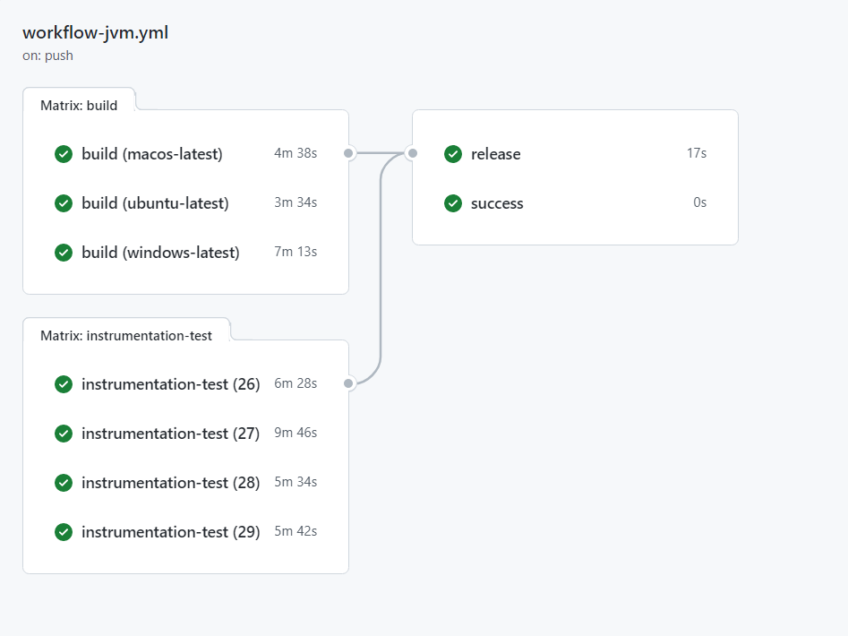

# Continuous integration

La *Continuous Integration* è una pratica importante nello sviluppo del software che consiste nel compilare, testare e distribuire frequentemente il codice sorgente in modo da garantire che le modifiche non introducano errori nel software esistente.

Come detto nei capitoli precedenti, il codice del sistema è organizzato in più repository, per cui è stato realizzato un processo di automazione per ogni repository tramite l'utilizzo delle **GitHub Actions**. Di seguito, verranno descritte le configurazioni di *continuous integration* eseguite per ogni progetto.

## Sistema di automazione

Il Sistema di automazione è composto da due sotto-progetti: uno per la scheda di **Arduino** e uno per la scheda **NodeMCU Esp8266**. Il *workflow* realizzato si occupa quindi di compilare i due progetti sulla rispettiva scheda. 

Il *workflow* è impostato per eseguirsi ogni volta che viene effettuato una *push* al repository e include tre *jobs* principali: `compile-sketch`, `find-tag` e `deploy`.

Il primo *job*, `compile-sketch`, si occupa di compilare i due *sketch* `ArduinoProject` e `EspProject` nelle rispettive schede. Per fare questo, utilizza l'*action* [arduino/compile-sketches@v1](https://github.com/arduino/compile-sketches#readme) per la compilazione del progetto.

Il secondo *job*, `find-tag`, verrà eseguito solo se il primo *job* è stato eseguito con successo e se la modifica è stata effettuata sul branch *master*. Questo *job* si occupa di verificare se nel messaggio di commit è presente uno speciale segnalatore `-TAG`. Nel caso sia presente vuol dire che è stato specificato un tag manualmente, ciò può avvenire qualora si voglia far avanzare la versione *Major* o *Minor* avendo fatto cambiamenti significativi. Qualora non venisse specificato un tag, viene generato in automatico un nuovo tag incrementando l'ultimo numero (*bugfix*) del tag esistente.

Il terzo *job*, `deploy`, verrà attivato solamente se è stato generato correttamente il tag nel *job* precedente. Questo *job* crea una nuova *release* sul repository di GitHub e la pubblica utilizzando l'*action* [actions/create-release@v1](https://github.com/actions/create-release).

 
[Fig 1] Pipeline implementata per il sistema di automazione

## Server

Il *workflow* realizzato per il Server è composto da tre *job* principali: `build`, `release` e `success`.

Il primo *job*, `build`, è responsabile di compilare e testare il codice su tre sistemi operativi diversi: *Ubuntu*, *macOS* e *Windows*. Durante questa fase viene configurato il database MongoDB utilizzando l'*action* [ankane/setup-mongodb@v1](https://github.com/ankane/setup-mongodb) e caricato il database iniziale per poter effettuare i test. Il codice viene compilato e testato con Gradle e, se tutti i test hanno esito positivo, la fase di `build` viene considerata completata con successo. 

Il secondo *job*, `release`, è responsabile della distribuzione del codice compilato e testato. Durante questa fase, il codice viene scaricato, viene configurato Node.js e viene eseguito un comando di rilascio utilizzando la libreria `semantic-release`, che verrà spiegato più in dettaglio nel capitolo successivo sul Version control.

Il terzo *job*, `success`, viene eseguita solo se le fasi di `build` ha avuto esito positivo. Durante questa fase, viene eseguito un passaggio che verifica che non vi siano stati errori durante le fasi precedenti. Se tutti i passaggi hanno esito positivo, il *workflow* viene considerato completato con successo.

 
[Fig 2] Pipeline implementata per il Server

## Client Desktop

Il *workflow* realizzato per il Client Desktop risulta molto simile a quella del Server, l'unica cosa che cambia è che non ha bisogno di impostare il database MongoDB.

Anche in questo caso il *workflow* è eseguito ogni volta che viene effettuato una *push*.

Il workflow è diviso in tre *jobs* principali: `build`, `release` e `success`. Il *job* `build` consiste nel compilare il codice ed eseguire i test sui tre sistemi operativi: *Linux*, *macOS* e *Windows*.

Successivamente c'è la fase di `release` per effettuare il rilascio del codice in automatico.

Infine, la fase `success` verifica se ci sono stati errori durante l'esecuzione dei *jobs* precedenti.

 
[Fig 3] Pipeline implementata per il Client Desktop

## Client Mobile

Il Client Mobile, come spiegato precedentemente, è un'applicazione sviluppata in Android, per cui nel suo *workflow* avrà bisogno di impostare l'emulatore **Android**.

Il *workflow* consiste in quattro *jobs* principali: `build`, `instrumentation-test`, `release` e `success`.

Il primo *job*, `build`, esegue il processo di compilazione dell'applicazione mobile per verificare che il codice sia corretto. Viene eseguito su tre sistemi operativi diversi (*Ubuntu*, *macOS*, *Windows*) utilizzando *JDK 11*. Una volta verificato la `build`, vengono eseguite gli *unit-test* implementati con JUnit. 

Il secondo *job*, `instrumentation-test`, si occupa di eseguire i test dell'applicazione su un emulatore Android utilizzando l'*action* [reactivecircus/android-emulator-runner@v2](https://github.com/ReactiveCircus/android-emulator-runner). È stata creata una matrice per testare l'applicazione con tre diverse API-level di Android: (26, 27, 28, 29).

Il terzo *job*, `release`, esegue il processo di rilascio dell'applicazione mobile su GitHub utilizzando la libreria `semantic-release`.

Il quarto *job*, `success`, verifica che non ci siano stati errori durante le fasi precedenti (`build`, `instrumentation-test`).

 
[Fig 4] Pipeline implementata per il Client Mobile

