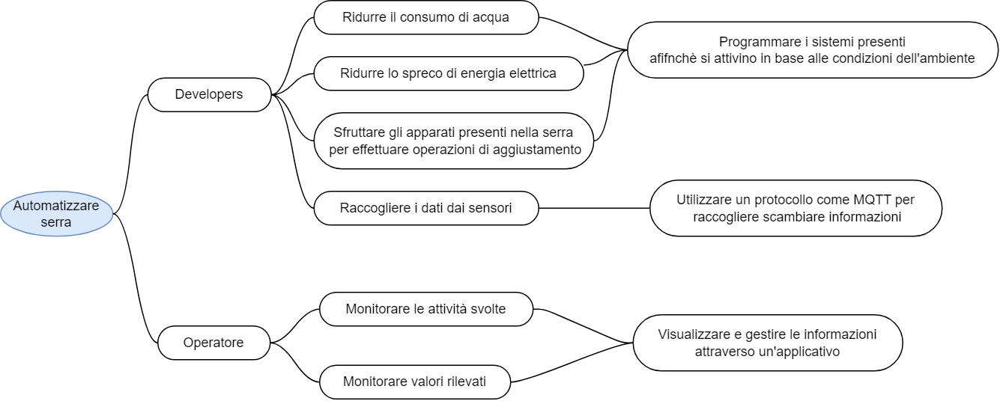

## Richiesta committente

“Sono un produttore agricolo e mi occupo della coltivazione in serra di peperoncini.

Nell’ultimo periodo, dato il crescente aumento dei costi per la produzione e le problematiche legate ai cambiamenti climatici, sarei interessato a rendere la mia serra smart, cercando di realizzare così un’agricoltura di precisione, che mi consenta di aumentare e migliorare la produzione, riducendo i costi ad essa legati.

Nella mia serra sono già presenti dei sensori per monitorare parametri delle piante, ma al momento le operazioni per la loro cura sono svolte manualmente dagli operatori, che tuttavia non sempre agiscono tempestivamente a situazioni critiche e non presentano tutti lo stesso grado di esperienza.

In parte il fatto che gli operatori non siano in grado di agire tempestivamente è dovuto al fatto che i valori dei parametri monitorati possono essere visualizzati solo in un apposito pannello di controllo all’entrata della serra, quindi, è possibile visionarli solo in loco. Non vi è di fatto alcuna applicazione che li consenta in modo agevole di monitorare lo stato della serra e di rilevare l’allarme.”

### Impact map

A seguito della richiesta precedentemente illustrata, il team di sviluppo ha deciso di produrre la seguente impact map, per riuscire a comprendere maggiormente il problema e formulare domande significative nelle successive interviste.

Impact map

Nell’immagine, il primo livello dell’impact map rappresenta l’obiettivo che si vuole ottenere: **Automatizzare la serra,** gli attori coinvolti nel raggiungere questo obiettivo sono sia gli sviluppatori che gli operatori all’interno della serra. 

Nello specifico, gli sviluppatori per ottenere l’automatizzazione della serra dovranno essere in grado di:

- Ridurre il consumo di acqua
- Ridurre lo spreco di energia elettrica
- Sfruttare gli apparati presenti nella serra per effettuare operazioni correttive dei parametri

Per poter raggiungere questi obiettivi il team di sviluppo dovrà programmare i sistemi presenti nella serra, affinché si attivino in base alle condizioni dell’ambiente e per raccogliere i dati dai sensori dovranno utilizzare appositi protocolli per lo scambio di informazioni, come ad esempio MQTT.

Mentre gli operatori avranno come obiettivo quello di monitorare le attività svolte e i valori rilevati. Per poter raggiungere tale obiettivo, l’operatore dovrà poter visualizzare e gestire le informazioni tramite un applicativo appositamente realizzato.