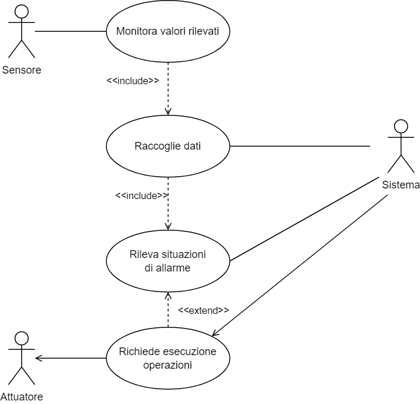
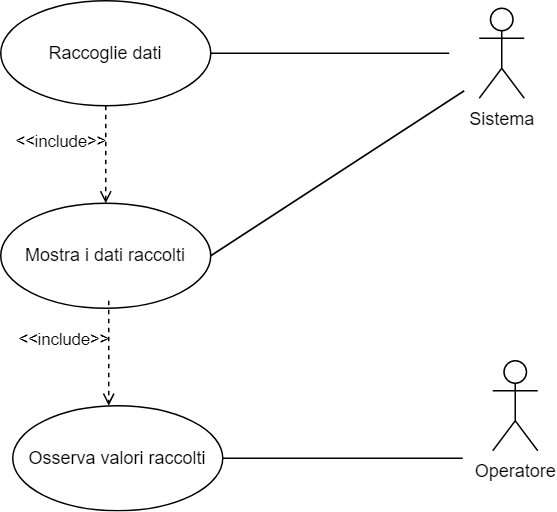
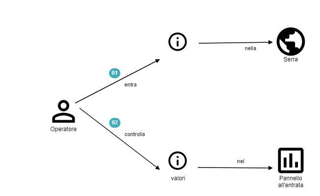
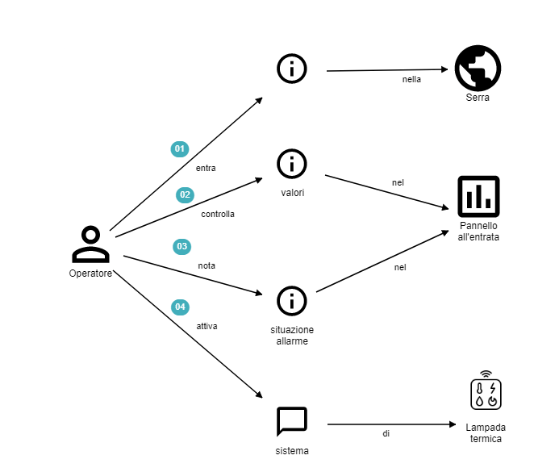
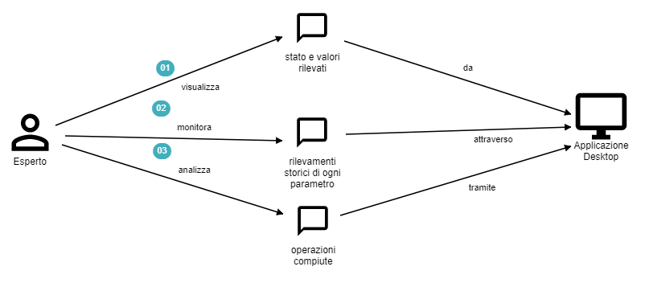
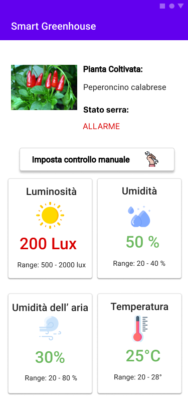

## Knowledge crunching

Dopo aver analizzato la richiesta che è stata effettuata e prodotto l’impact map si è tenuto la prima intervista con il committente, riportata di seguito.

**Analista**: Nella sua richiesta ci ha chiesto la realizzazione di una smart serra, ci chiediamo quindi, che cosa intende per smart serra?

**Esperto**: Intendo una serra che sia in grado di gestire in modo automatico o semi automatico, quindi senza il costante intervento umano, principali attività per il benessere della crescita della pianta.

**Analista**: Quali sono le attività in questione, che vorresti quindi automatizzare? 

**Esperto**: le attività che mi interessa automatizzare, sono:

- sicuramente l’irrigazione, quindi capire quando è opportuno irrigare il terreno, così da ridurre al minimo anche lo spreco di acqua;
- la regolazione della luminosità dell'ambiente, quindi essere in grado di dare alle piante la condizione ottimale di luminosità ideale per la loro crescita;
- regolare la temperatura in modo tale da adattarla a quella ideale per la pianta coltivata, per esempio una pianta tropicale, se coltivata in un luogo tipicamente freddo, avrà bisogno di una temperatura più elevata all'interno della serra;
- regolare l’umidità ambientale, in quanto anch’essa legata al benessere della pianta.

**Analista**: La serra, già dispone di apparati capaci di monitorare e agire su questi aspetti? 

**Esperto**: Si, all’interno della serra sono già presenti:  delle ventole il cui scopo è ridurre la temperatura e l’umidità ambientale, delle lampade che consentono di regolare l’intensità luminosa, delle lampade termiche che influiscono sulla temperatura, ed infine, è presente un sistema di irrigazione costituito da una pompa ad acqua.

Tuttavia questi aspetti, fino ad ora, sono stati gestiti manualmente da un operatore in base all’esperienza e ai dati misurati dai sensori.

**Analista**: Quindi, prima mi hai detto che volevi regolare anche la luminosità e l’umidità del terreno, ma all’interno della serra non vi sono dei sensori che rilevano questi parametri?

**Esperto**: No all’ interno della serra sono presenti anche sensori che ci rilevano queste informazioni che sono sempre visibili nel pannello di controllo.

**Analista**: E oltre agli apparati già presenti: lampade, ventole lampade termiche ecc. vorresti investire in altri apparati per automatizzare la tua serra?

**Esperto**: No , in questo momento vorrei usare solo gli apparati che sono già presenti, e inserire solo i sensori che mi mancano per luminosità è umidità del suolo, ma in futuro se le cose vanno bene, posso pensare di modernizzare e rinnovare le tecnologie usate.

**Analista**: Abbiamo parlato di automatizzare la serra, supponendo di averlo fatto, cosa ti aspetti dal sistema ora?

**Esperto**: Mi piacerebbe avere la possibilità di gestirla dal telefono.

**Analista**: Cosa intendi con gestirla dal telefono?

**Esperto**: Vorrei avere un’applicazione sul mio smartphone, che mi dia la possibilità di prendere il controllo manuale della gestione della serra e poter richiedere l’esecuzione di quelle operazioni dette prima, come l’irrigazione, la regolazione della luminosità della temperatura ecc. 

Quindi, io, semplicemente premendo dei tasti vorrei compiere queste azioni sulla serra manualmente.

**Analista**: Ma oltre a compiere le operazioni sulla serra, sei interessato anche a visualizzare i parametri rilevati, come umidità temperatura ecc.?

**Esperto**: Assolutamente sì, anche perché in questo modo posso capire quale azione posso compiere.

**Analista**: Cosa intendi con posso “capire quali azioni posso compiere”?

**Esperto**:  Mi aspetto che l’applicazione mi mostri il parametro in allarme e allora in questo modo posso capire quali sono i sistemi su cui è meglio agire per intervenire.

**Analista**: Sarebbe utile per te avere dall’applicazione, anche delle altre informazioni sulla serra, oltre alle situazioni di allarme?

**Esperto**: Sì, sapendo che i miei operatori hanno diversi livelli di esperienza, per poter aiutare anche quelli più inesperti, sarebbe utile avere informazioni sulla pianta coltivata all’interno e i range ottimali di riferimento in cui mantenere i valori. In questo modo gli aiuterebbe anche a tarare le diverse operazioni se ce ne fosse bisogno.

**Analista**: I range di riferimento per la pianta come vengono individuati?

 **Esperto**: Quando acquistiamo le piante il venditore ci fornisce anche un opuscolo con i valori ottimali di riferimento per diversi parametri.

**Analista**: Ti interessa mantenere salvate le operazioni effettuate dal sistema e dagli operatori e i parametri rilevati?

**Esperto**: Si, mi interessa anche perché vorrei controllare come funziona il sistema e anche il lavoro svolto dai miei dipendenti.

**Analista**: Quali sono i parametri di cui vuoi mantenere salvate le operazioni?

**Esperto**: Tutti quelli detti prima.

**Analista**: Tutte queste informazioni le vorresti sempre vedere sull’applicazione mobile?

**Esperto**: Allora, adesso che ci penso, anche dal mio ufficio mi piacerebbe vedere i dati sul mio portatile, quindi vorrei avere un’applicazione da usare sul computer che mi consenta di vedere i dati storici, quelli attuali e le operazioni compiute dall’operatore o dal sistema in automatico e di sapere lo stato attuale della serra. 

**Analista**: Quindi, nell’applicazione mobile non è necessario inserire i dati storici e le operazioni svolte?

**Esperto**: No per ora non credo sia necessario, per l’applicazione mobile vorrei una cosa semplice e veloce, io o un mio dipendente entriamo nella serra, controlliamo lo stato e eventualmente modifichiamo qualcosa manualmente tramite l’app.

### Diagrammi dei casi d’uso

A partire da ciò che è emerso dalle precedenti fasi dell’analisi sono stati dedotti tre casi d'uso principali.

Diagramma dei casi d’uso: monitoraggio valori

Il diagramma visualizzato in figura, mostra il caso d'uso relativo al monitoraggio dei valori della pianta e della rilevazione di situazioni di allarme da parte del sistema.
Come si può vedere, gli attori principali, in questo caso, sono tre:

- **sensore**, il quale rappresenta una componente del sistema di automazione incaricata di rilevare un parametro vitale della pianta;
- **sistema**, che rappresenta sostanzialmente una componente che si occupa di raccogliere i dati monitorati all'interno della serra, dopo che questi sono stati raccolti dal sensore, e di analizzarli per poter rilevare eventuali situazioni di allarme e nel caso uno o più dei parametri rilevati risultino presentare dei valori critici, si occupa di richiedere l'esecuzione di operazioni correttive, al fine di riportarli nei range ottimali;
- **attuatore**, rappresenta una componente hardware, in grado di agire sull'ambiente della serra e che si occupa di attuare le operazioni correttive richieste dal sistema.

Diagramma dei casi d’uso: raccolta dati

Questo caso d'uso, invece, fa riferimento alla raccolta dei dati da parte del sistema e la loro successiva visualizzazione da parte dell'utente.

In questo caso d'uso è possibile identificare due attori:

- **sistema**, che è incaricato di raccogliere i dati e di mostrarli successivamente all'utente;
- **operatore**, il quale interagendo attraverso le applicazioni è in grado di poter osservare i dati raccolti e memorizzati all'interno del sistema.

Diagramma dei casi d’uso: controllo manuale

L'ultimo caso d'uso, si concentra sulla richiesta del controllo manuale della gestione della serra da parte dell'operatore.
Il caso d'uso in esame prevede come attori:

- **operatore**, il quale tramite l'interfaccia grafica può richiedere il controllo manuale della serra;
- **sistema**, che si occupa di ricevere e gestire la richiesta di presa del controllo manuale da parte dell'operatore;
- **attuatore**, che si occupa di eseguire le operazioni correttive richieste precedentemente.

### Domain storytelling

Dopo aver sviluppato i diagrammi dei casi d’uso, il team di sviluppo ha richiesto una seconda intervista con gli esperti del dominio che coinvolgesse anche gli operatori incaricati di gestire e monitorare la serra, in modo da raccogliere quante più informazioni possibili relative al dominio e alle sue dinamiche e come ci si aspetti che il sistema si comporti.

Per questa seconda intervista si è deciso di utilizzare la strategia del domain storytelling, la quale prevede di lasciare raccontare agli esperti del dominio come vengono svolte le diverse operazioni all’interno del contesto in esame e cosa si vorrebbe ottenere come risultato, mentre il team di sviluppo si occupa di catturare il racconto effettuato dall’esperto del dominio, tramite l’utilizzo di un linguaggio pittografico.

Il risultato emerso da questa seconda intervista verrà di seguito mostrato, in particolare, ogni user story è stata illustrata tramite le domande poste dall’analista all’esperto e un apposito diagramma facente uso di un linguaggio pittografico.

**User story: gestione attuale**

Analista: Come avviene la gestione della serra da parte tua, quali sono le operazioni che svolgi?

Esperto (operatore): Quando entro nella serra, per prima cosa guardo il pannello all’ entrata e controllo i valori dell’umidità dell’aria e della temperatura, se mi rendo conto che non vanno bene ad esempio se la temperatura è troppo bassa, attivo le lampade termiche per un po’ fino a quando non noto un’innalzamento

Domain story telling: gestione attuale - monitoraggio dei valori

Analista: E se non ci sono valori critici quali sono le normali operazioni che compi?

Esperto(operatore): Se il valori rilevati sono buoni non faccio nulla, se invece si avvicinano a valori critici, ad esempio se l’umidità del suolo e vicino al valore più basso attivo il sistema di irrigazione, quindi in tal caso agisco come se ci fosse una situazione di allarme.

Domain story telling: gestione attuale - stato della serra in allarme

**User story: applicazione desktop**

Analista: Come vorresti che funzionasse il sistema, hai parlato di un’applicazione desktop, come vorresti che fosse organizzata, cosa vuoi vedere nelle diverse schermate?

Esperto: Appena apro l’app vorrei vedere i valori rilevati e il relativo stato; sono anche interessato a vedere lo storico dei rilevamenti di ogni parametro, magari mediante sia una rappresentazione tabellare che con un grafico che mi permetta di avere un’idea dell’andamento dei rilevamenti. Infine, vorrei vedere anche quali sono le operazioni compiute all’interno della serra in modo da monitorarle ed analizzarle.

Domain story telling: applicazione desktop

**User story: applicazione mobile**

Analista: Per quanto riguarda, invece, l’applicazione mobile cosa vorresti che facesse o mostrasse?

Esperto: Anche qui vorrei avere subito la visualizzazione dello stato della serra, quindi per ogni parametro vedere sia il valore attuale che lo stato. Inoltre vorrei riuscire a prendere il controllo manuale della serra in modo da gestirne i diversi apparati.

Analista: Quando parli di gestire gli apparati, come intendi agire?

Esperto: Mi aspetto ad esempio di aprire l'applicazione, vedere lo stato dei parametri e decidere di prendere il controllo manuale e da qui mi aspetto che l’applicazione mi mostri le diverse operazioni che posso compiere e che mi permetta di effettuarle.

Domain story telling: applicazione mobile

### Mock-up e prototipo delle applicazioni

A seguito della seconda intervista effettuata e grazie alle informazioni finora raccolte, il team di sviluppo ha prodotto i seguenti mock-up relativi all’applicazione desktop e mobile richiesta dall’utente.

Tali mock-up sono stati presentati e discussi assieme agli esperti del domino, in modo da poter verificare la loro correttezza e in caso modificarli per meglio adattarli alle loro richieste.

I diversi mock-up e prototipi sono stati realizzati tramite lo strumento [Figma](https://www.figma.com/design/) e per poter visionare il prototipi si può fare riferimento ai seguenti link: 

- [prototipo applicazione Desktop](https://www.figma.com/proto/XQUgc7GXJofBcpS4CKYHSc/SmartGreenhouse?node-id=8%3A2&scaling=min-zoom&page-id=0%3A1&starting-point-node-id=8%3A2&show-proto-sidebar=1)
- [prototipo applicazione Mobile](https://www.figma.com/proto/XQUgc7GXJofBcpS4CKYHSc/SmartGreenhouse?node-id=10%3A517&scaling=min-zoom&page-id=0%3A1&starting-point-node-id=10%3A517&show-proto-sidebar=1)

**Mock-up applicazione Desktop**

Come si può vedere dalle figure, l'applicazione desktop che si intende realizzare prevede tre schermate:

- la pagina principale, che contiene tutte le informazioni relative alla pianta coltivata all’interno della serra, lo stato globale della serra ed un’indicazione dei parametri rilevati;
- la pagina di dettaglio di un parametro, che è raggiungibile mediante la selezione di uno dei parametri presenti nella schermata principale e si occupa di mostrare lo storico delle rilevazioni del parametro in oggetto;
- la pagina di riepilogo delle operazioni, sempre raggiungibile dalla schermata principale, si occupa di mostrare il riepilogo delle operazioni anche eventualmente filtrate per parametro o range temporale.

Mock-up applicazione desktop: pagina principale

Mock-up applicazione desktop: pagina di dettaglio di un parametro

Mock-up applicazione desktop: pagina delle operazioni

**Mock-up applicazione mobile**

L’applicazione Mobile, invece, è costituita da due schermate principali:

- nella prima è possibile visualizzare una descrizione della pianta coltivata all’interno della serra, l’informazione relativa allo stato della serra se è in allarme oppure no e i valori attuali dei parametri rilevati con anche il riferimento ai range ottimali previsti. Infine, è presente un pulsante per prendere il controllo manuale della gestione;
- nella seconda schermata vengono visualizzate le impostazioni del controllo manuale dell’applicazione, in particolare per ogni parametro vengono visualizzati gli opportuni controllers che consentono di agire sui sistemi della serra.

Mock-up applicazione mobile: schermata principale

Mock-up applicazione mobile: controllo automatico

Mock-up applicazione mobile: controllo manuale

