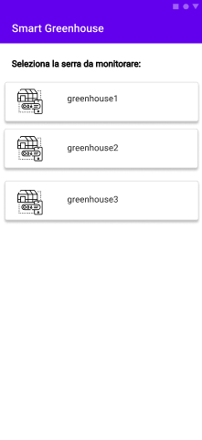

# Diagrammi dei casi d’uso

A partire da ciò che è emerso dalla richiesta e da successive interviste che sono state effettuate con il committente, sono stati dedotti tre casi d'uso principali.

[Fig 1] Diagramma dei casi d’uso: monitoraggio valori

Il diagramma visualizzato in <a href="#fig1"> figura 1</a>, mostra il caso d'uso relativo al monitoraggio dei valori della pianta e della rilevazione di situazioni di allarme da parte del sistema.
Come si può vedere, gli attori principali, in questo caso, sono tre:

- **sensore**, il quale rappresenta una componente del sistema di automazione incaricata di rilevare un parametro vitale della pianta;
- **sistema**, che rappresenta sostanzialmente una componente che si occupa di raccogliere i dati monitorati all'interno della serra, dopo che questi sono stati raccolti dal sensore, e di analizzarli per poter rilevare eventuali situazioni di allarme e nel caso uno o più dei parametri rilevati risultino presentare dei valori critici, si occupa di richiedere l'esecuzione di operazioni correttive, al fine di riportarli nei range ottimali;
- **attuatore**, rappresenta una componente hardware, in grado di agire sull'ambiente della serra e che si occupa di attuare le operazioni correttive richieste dal sistema.

[Fig 2] Diagramma dei casi d’uso: raccolta dati

Questo caso d'uso (<a href="#fig2"> figura 2</a>), invece, fa riferimento alla raccolta dei dati da parte del sistema e la loro successiva visualizzazione da parte dell'utente.

In questo caso d'uso è possibile identificare due attori:

- **sistema**, che è incaricato di raccogliere i dati e di mostrarli successivamente all'utente;
- **operatore**, il quale interagendo attraverso le applicazioni è in grado di poter osservare i dati raccolti e memorizzati all'interno del sistema.

[Fig 3] Diagramma dei casi d’uso: controllo manuale

L'ultimo caso d'uso (<a href="#fig3"> figura 3</a>), si concentra sulla richiesta del controllo manuale della gestione della serra da parte dell'operatore.
Il caso d'uso in esame prevede come attori:

- **operatore**, il quale tramite l'interfaccia grafica può richiedere il controllo manuale della serra;
- **sistema**, che si occupa di ricevere e gestire la richiesta di presa del controllo manuale da parte dell'operatore;
- **attuatore**, che si occupa di eseguire le operazioni correttive richieste precedentemente.

## Mock-up e prototipo delle applicazioni

Alla fine delle interviste e grazie alle informazioni raccolte, il team di sviluppo ha prodotto i seguenti mock-up relativi all’applicazione desktop e mobile richiesta dall'utente.

Tali mock-up sono stati presentati e discussi assieme agli esperti del dominio, in modo da poter verificare la loro correttezza e in caso modificarli per meglio adattarli alle loro richieste.

I diversi mock-up e prototipi sono stati realizzati tramite lo strumento [Figma](https://www.figma.com/design/) e per poter visionare il prototipi si può fare riferimento ai seguenti link: 

- [prototipo applicazione Desktop](https://www.figma.com/proto/XQUgc7GXJofBcpS4CKYHSc/SmartGreenhouse?node-id=8%3A2&scaling=min-zoom&page-id=0%3A1&starting-point-node-id=8%3A2&show-proto-sidebar=1)
- [prototipo applicazione Mobile](https://www.figma.com/proto/XQUgc7GXJofBcpS4CKYHSc/SmartGreenhouse?node-id=10%3A517&scaling=min-zoom&page-id=0%3A1&starting-point-node-id=10%3A517&show-proto-sidebar=1)

**Mock-up applicazione Desktop**

Come si può vedere dalle figure, l'applicazione desktop che si intende realizzare prevede tre schermate:

- la pagina principale (<a href="#fig8"> figura 8</a>), che contiene tutte le informazioni relative alla pianta coltivata all’interno della serra, lo stato globale della serra ed un’indicazione dei parametri rilevati;
- la pagina di dettaglio di un parametro (<a href="#fig9"> figura 9</a>), che è raggiungibile mediante la selezione di uno dei parametri presenti nella schermata principale e si occupa di mostrare lo storico delle rilevazioni del parametro in oggetto;
- la pagina di riepilogo delle operazioni (<a href="#fig10"> figura 10</a>), sempre raggiungibile dalla schermata principale, si occupa di mostrare il riepilogo delle operazioni anche eventualmente filtrate per parametro o range temporale.

[Fig 8] Mock-up applicazione desktop: pagina principale

[Fig 9] Mock-up applicazione desktop: pagina di dettaglio di un parametro

[Fig 10] Mock-up applicazione desktop: pagina delle operazioni

**Mock-up applicazione mobile**

L’applicazione Mobile, invece, è costituita da tre schermate principali:

- nella prima (<a href="#fig11"> figura 11</a>) è possibile decidere la serra che si desidera monitorare;
- nella seconda (<a href="#fig11"> figura 12</a>) è possibile visualizzare una descrizione della pianta coltivata all’interno della serra, l’informazione relativa allo stato della serra se è in allarme oppure no e i valori attuali dei parametri rilevati con anche il riferimento ai range ottimali previsti. Infine, è presente un pulsante per prendere il controllo manuale della gestione;
- nella seconda schermata (<a href="#fig12"> figura 13</a> e <a href="#fig13"> figura 14</a> )  vengono visualizzate le impostazioni del controllo manuale dell’applicazione, in particolare per ogni parametro vengono visualizzati gli opportuni controllers che consentono di agire sui sistemi della serra.

[Fig 11] Mock-up applicazione mobile: selezione serra

[Fig 12] Mock-up applicazione mobile: dettaglio serra

[Fig 13] Mock-up applicazione mobile: controllo automatico

[Fig 14] Mock-up applicazione mobile: controllo manuale

