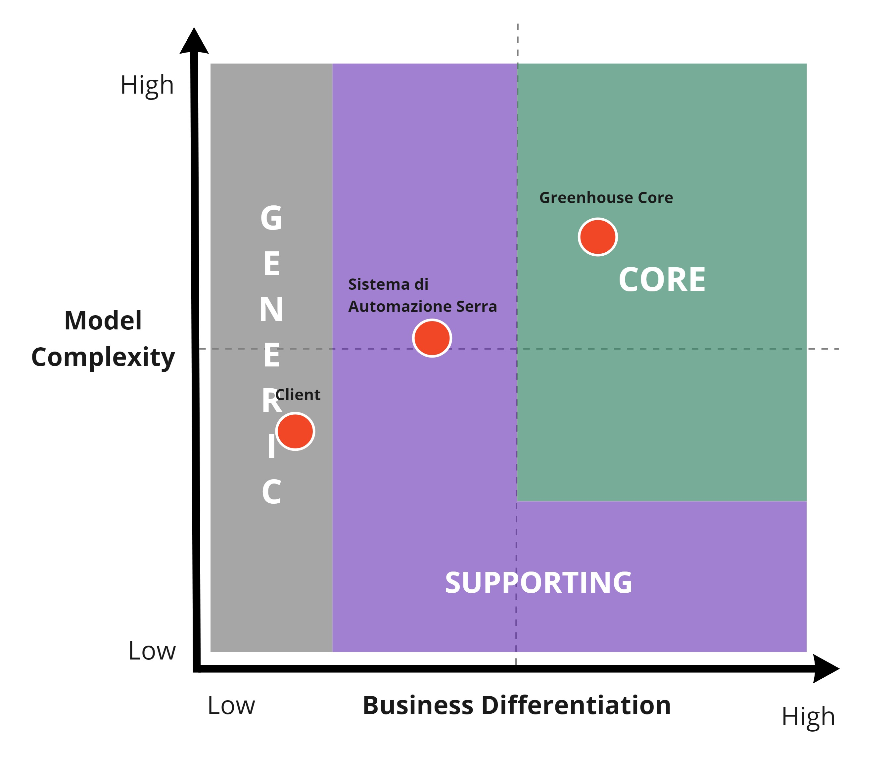
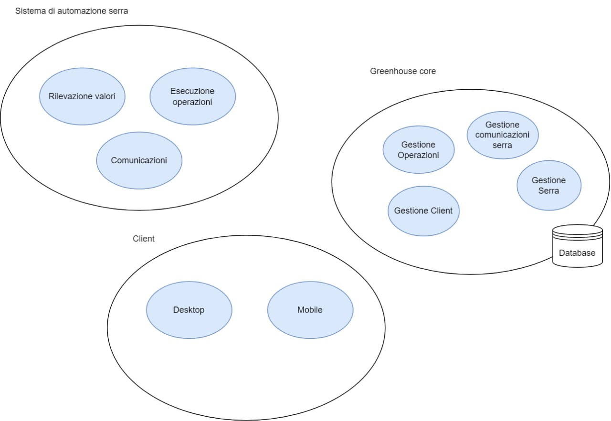
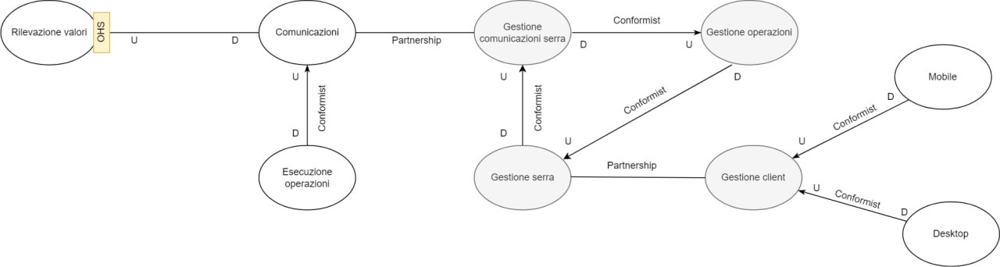

# Analisi dei sottodomini

Nel Domain Driven Design per poter meglio gestire la complessità del dominio che si vuole analizzare si consiglia di esplorare a fondo il problem-domain individuando sottodomini che siano più semplici da gestire, inoltre, è importante associare ad ognuno di questi sotto-domini individuati un’importanza: core, generic, support, in modo da aiutare gli sviluppatori a comprendere meglio quali sono gli aspetti principali su cui ci si dovrà concentrare. 

Per il problema in esame il tema di sviluppo a seguito del processo di knowledge crunching e di analisi del dominio che è stata eseguita, è riuscito ad individuare quattro sotto-domini principali:

- **Sistema di automazione serra**, il quale racchiude gli elementi presenti all’interno della serra che consentono la sua gestione in modo automatico;
- **Greenhouse core**, il quale racchiude le funzionalità principali di gestione dei dati raccolti dal sistema di automazione;
- **Client**, che comprende i diversi elementi necessari affinché possa essere effettuata un’analisi dello stato della serra e della coltivazione tramite un’applicazione Desktop e per poter monitorare e gestire la serra tramite un’applicazione Mobile;

Una volta individuati i seguenti sotto-domini, il team ha cercato di individuare l’importanza strategica che questi possiedono per il business, aiutandosi attraverso l’utilizzo dei domain charts.

[Fig 1] Core Domain Chart

Come si può vedere dal grafico (<a href="#fig1"> figura 1</a>), il sub-domain: sistema di automazione serra, è stato classificato come **supporting domain,** in quanto, racchiude al suo interno tecnologie e sistemi che possono essere utilizzati come supporto per le funzionalità principali di gestione della serra. Inoltre, il modello che si intende realizzare non ha una complessità molto elevata e una Business Differentiation buona, ma non così alta da renderlo un core domain. 

Greenhouse core, invece, è stato identificato come **core-domain**. Il modello che si intende realizzare per questo dominio è abbastanza complesso, per di più se le funzionalità che si vogliono realizzare vengono gestite in modo opportuno si può ottenere un buon livello di business differentiation per l’organizzazione.

Infine, il sub-domain clients è stato classificato come **generic-domain**, in quanto non comprende elementi che possono contribuire a un’elevata differenziazione del business e il modello che si vuole realizzare, non è molto complesso.

## Bounded context

Dopo aver individuato i diversi sotto-domini di cui si compone il sistema, si è passati alla definizione e individuazione dei diversi bounded context che possono essere contenuti al loro interno (<a href="#fig1"> figura 1</a>). 

[Fig 1] Individuazione dei diversi bounded context del sistema

Il sub-domain **sistema di automazione serra**, si compone di tre diversi bounded context:

- **Rilevazione valori,** il quale racchiude i diversi sensori necessari per poter rilevare i parametri vitali delle piante presenti all’interno della serra
- **Esecuzione operazioni,** il quale racchiude gli elementi che si occupano di gestire la logica per l’esecuzione delle diverse operazioni che possono essere richieste dall'operatore o dal sistema.
- **Comunicazioni**, che comprende tutti i diversi elementi necessari per poter inviare i dati rilevati e ricevere i comandi relativi alle operazioni da eseguire.

Il sub-domain **greenhouse core** presenta al suo interno quattro bounded context che sono:

- **Gestione comunicazioni serra**, il quale si occupa di gestire le comunicazioni con il sistema di automazione della serra;
- **Gestione serra**, che si occupa di raccogliere e gestire i dati rilevati all’interno della serra dai rispettivi sensori;
- **Gestione operazioni**, il quale si occupa di raccogliere le operazioni che il sistema o l’operatore hanno richiesto di eseguire;
- **Gestione comunicazioni client**, il quale si occupa di gestire le comunicazioni con i client Desktop e Mobile.

Il sub-domain client, è costituito dai seguenti bounded-context:

- **Mobile**, il quale detiene gli elementi necessari per consentire il monitoraggio dello stato della serra e la sua gestione in modalità manuale da parte di un operatore tramite un’applicazione Mobile
- **Desktop**, che detiene gli elementi affinché possa essere effettuata un’analisi della situazione attuale della serra e delle operazioni compiute al suo interno, tramite l’utilizzo di un’applicazione Desktop.

### Context map

A seguito di quanto è stato detto nelle precedenti sezioni le relazioni fra i diversi bounded context possono essere rappresentate tramite la seguente context map (<a href="#fig2"> figura 2</a>).

[Fig 2] Context map

All’interno della context map, i bounded-context colorati in grigio fanno riferimento al core domain: greenhouse core; mentre i bounded context bianchi fanno riferimento ai support e generic sub-domain: sistema di automazione serra e client.

Tutte le diverse relazioni di tipo customer-supplier, tranne quella che lega il bounded context rilevazione valori con il bounded context comunicazioni, sono conformiste, il che significa che il *downstream* si adatta alle informazioni che vengono passate dall'*upstream* così come sono senza porre vincoli o cambiamenti. Nel caso, invece, del bounded context **rilevazione valori** è stata adottata la strategia *Open Host Service,* di conseguenza, è il bounded context *upstream* che si impegna nel fornire il miglior servizio possibile al bounded context *downstream*, adattando le informazioni inviate alle sue esigenze; nel nostro caso le informazioni inviate vengono adattate in modo tale che possano essere direttamente comunicate al bounded context gestione comunicazioni serra, da parte del bounded context comunicazioni, senza ulteriori elaborazioni.

Fra i bounded context comunicazioni e gestione comunicazioni serra vi è una relazione di *partnership*, in quanto, comunicazioni si occupa di fornire i dati rilevati dai sensori a gestione comunicazioni serra, mentre quest’ultimo, si occupa di inviare al bounded context comunicazioni le operazioni correttive che devono essere intraprese.

