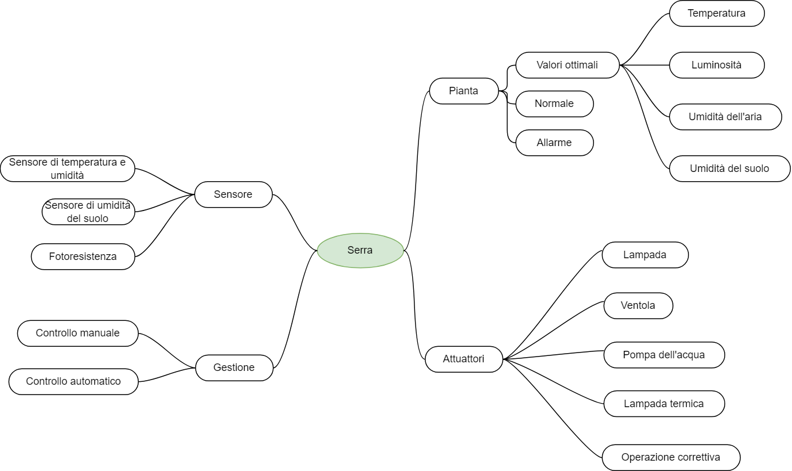

## Ubiquitous language

Durante i diversi incontri che sono stati effettuati con gli esperti del dominio il team di sviluppo si è occupato di ricercare, fra le diverse parole utilizzate dagli esperti i termini che definiscono l’ubiquitous language.

Di seguito è possibile vedere un’immagine raffigurante i diversi termini individuati e le relazioni che vi sono fra di essi.

Ubiquitous language mind map

Infine, i termini dell’ubiquitous language sono stati raccolti nel seguente dizionario dei termini. 

Si noti che nel dizionario viene anche indicata la traduzione in lingua inglese del termine analizzato, in quanto, il codice verrà sviluppato in lingua inglese.

| Termine | Traduzione inglese termine | Definizione |
| --- | --- | --- |
| Serra | Greenhouse | E’ una struttura intelaiata con una copertura trasparente che fornisce un ambiente parzialmente o completamente controllato per una produttività ottimale |
| Pianta | Plant | Pianta coltivata all’interno della serra |
| Valori  ottimali | Optimal values | Valori minimi e massimi ideali per la pianta |
| Normale | Normal | Situazione in cui i valori rilevati non rientrano in quelli ottimali |
| Allarme | Alarm | Situazione in cui uno o più dei valori rilevati non rientrano in quelli ottimali |
| Temperatura | Temperature | Parametro relativo alla temperatura dell’aria |
| Luminosità | Brightness | Parametro relativo alla luminosità della serra |
| Umidità dell’aria | Humidity | Parametro relativo all’umidità dell’aria |
| Umidità del suolo | Soil moisture | Parametro relativo all’umidità del terreno |
| Attuatore | Actuator | Dispositivo in grado di agire su uno o più elementi dell’ambiente in cui è immerso |
| Lampada | Lamp | Lampada regolabile per la luminosità |
| Ventola | Fan | Componente automatizzata presente nella serra che comprende la ventola e il relativo motore |
| Pompa dell’acqua | Water pomp | Componente automatizzata presente nella serra che consente di irrigare il terreno |
| Lampada termica | Term lamp | Lampada riscaldante, per aumentare la temperatura |
| Operazione correttiva | Corrective operation | Operazione effettuata che prevede l’attivazione o la disattivazione di un attuatore all’interno della serra per far fronte a situazioni di allarme perchè richiesto manualmente dall’utente |
| Sensore | Sensor | Dispositivo in grado di rilevare un parametro dell’ambiente |
| Sensore di temperatura e umidità | Temperature and humidity sensor | Sensore che rileva il valore della temperatura e dell’umidità dell’aria |
| Sensore di umidità del suolo | Soil moisture sensor | Sensore che rileva il valore dell’umidità del terreno |
| Fotoresistenza | Photo resistor  | Sensore che rileva il valore della luminosità  |
| Gestione serra | Greenhouse modality | Indica la modalità di gestione della serra che può essere automatica o manuale |
| Controllo manuale | Manual control | Operazioni richieste dall’operatore dall’applicazione mobile |
| Controllo automatico | Automatic control | Operazioni compiute automaticamente dal sistema per correggere i valori non ottimali |