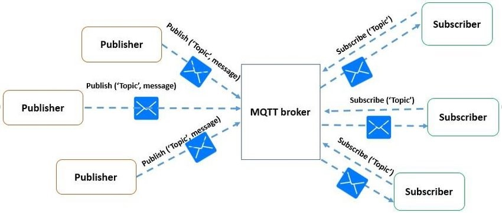

# Dettagli implementativi sistema di automazione
Il Sistema di automazione, come detto in precedenza è costituito da due parti principali, una componente Arduino che racchiude la scheda Arduino Uno, i sensori e gli attuatori presenti nella serra e una componente ESP, che invece comprende la scheda NodeMCU, utilizzata per inviare i dati in rete.

## Comunicazione tramite il protocollo MQTT
Per far comunicare fra loro il sistema di automazione con il resto del sistema di backend, in particolare con il micro-servizio ``GreenhouseCommunication``,  si è deciso di adottare il protocollo MQTT. 

Nello specifico MQTT, è un protocollo per lo scambio di messaggi di tipo publish/subscribe, pensato per poter inviare e ricevere i dati in modo accurato nonostante i ritardi della rete e la larghezza di banda ridotta. In questo tipo di protocollo si distinguono due ruoli principali che i processi possono ricoprire, il ruolo di _publisher_: cioè di colui che pubblica i messaggi relativamente a un certo topic, e quello di _subscriber_: che invece rappresenta colui che è interessato a ricevere i messaggi per un determinato argomento. 

MQTT è un protocollo asincrono: il _publisher_ pubblica i messaggi indipendentemente dal fatto che vi siano dei _subscribers_ interessati a riceverli e iscritti all'argomento. A regolare l'interazione fra _publisher_ e _subscriber_ viene utilizzato un _Message-Broker_, il quale si occupa di raccogliere i messaggi pubblicati dai _publishers_ e di inoltrarli ai _subscribers_, interessati a riceverli, come possibile vedere nella seguente <a href="fig1">figura 1</a>.

[fig 1] Architettura MQTT

Per il progetto, la componente ESP del sistema e il micro-servizio ``GreenhouseCommunication`` sono entrambi sia _publisher_ che _subscriber_; nello specifico:

- **ESP**, si occupa di pubblicare i dati relativi ai sensori tramite il topic dataSG ed è interessata a ricevere i messaggi relativi alle operazioni che il sistema deve compiere, quindi effettuerà la sottoscrizione ai topic: ``LUMINOSITY``, ``VENTILATION``, ``TEMPERATURE`` e ``IRRIGATION``;
- **GreenhouseCommunication**, è interessato a ricevere i messaggi relativi al topic dataSG, contenenti le rilevazioni effettuate dai sensori e in più si occupa di comunicare le operazioni da effettuare, tramite la pubblicazione dei messaggi relativi ai seguenti topic: ``LUMINOSITY``, ``VENTILATION``, ``TEMPERATURE`` e ``IRRIGATION``.
