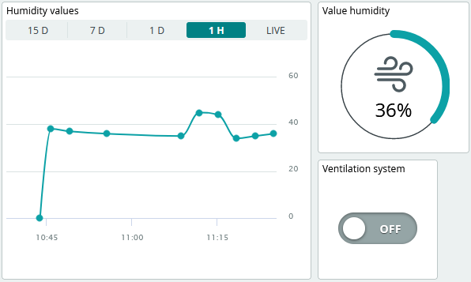
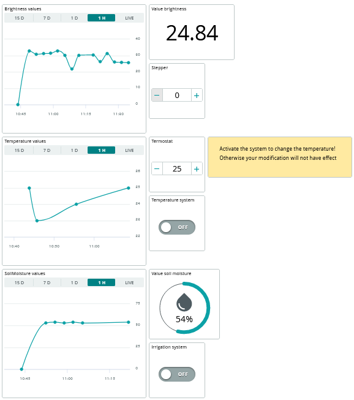

# Dettagli implementativi sistema di automazione
Il Sistema di automazione, come detto in precedenza è costituito da due parti principali, una componente Arduino che racchiude la scheda Arduino Uno, i sensori e gli attuatori presenti nella serra e una componente ESP, che invece comprende la scheda NodeMCU, utilizzata per inviare i dati in rete.

## Collegamento ad Arduino Cloud
Quando si crea una nuova "_Thing_" su Arduino Cloud e vi si associa a questa uno _skatch_, in automatico la piattaforma inserisce all'interno del progetto due file:

- `thingProperties.h`, contenente le diverse variabili Cloud dichiarate per la "_Thing_" e che si occupa dell'instaurazione della connessione al Cloud;
- `secret.h`, il quale contiene le diverse informazioni relative alla connessione di rete e alla chiave del dispositivo, necessarie per la connessione.

L'instaurazione della connessione effettiva alla piattaforma Cloud, avviene all'intenro del programma principale del progetto individuato dal file `.ino`. 

In particolare, all'interno del metodo `setup` del programma, come possibile vedere dal <a href="#lst1">listato 1</a>, avviene l'inizializzazione del Serial Monitor e delle proprietà utilizzando il metodo `initProperties`, la connessione ad Arduino Cloud viene inizializzata attraverso il metodo `ArduinoCloud.begin`, il quale utilizza funzioni che sono presenti all'interno delle librerie `ArduinoIoTCloud` e `Arduino_ConnectionHandler`, incluse all'interno del file `thingProperties.h`. Infine, gli altri due metodi richiamati `setDebugMessageLevel` e `ArduinoCloud.printDebugInfo`, vengono utilizzati per funzionalità di debug, essi infatti, si occupano di stampare le informazioni relative allo stato della rete e alla connessione ad Arduino Cloud.

```c++
void setup() {
  // Initialize serial and wait for port to open:
  Serial.begin(9600);
  // This delay gives the chance to wait for a Serial Monitor without blocking if none is found
  delay(1500);

  // Defined in thingProperties.h
  initProperties();

  //...

  // Connect to Arduino IoT Cloud
  ArduinoCloud.begin(ArduinoIoTPreferredConnection);

  /*
     The following function allows you to obtain more information
     related to the state of network and IoT Cloud connection and errors
     the higher number the more granular information you’ll get.
     The default is 0 (only errors).
     Maximum is 4
  */
  setDebugMessageLevel(2);
  ArduinoCloud.printDebugInfo();
}
```
<p align="center" id="lst1">[Listato 1] Connessione al Cloud</p>

All'interno del metodo `loop` (<a href="#lst2">listato 2</a>), invece, avviene la chiamata al metodo `ArduinoCloud.update`, il quale si occupa di mantenere aggiornati tutti i dviersi parametri del Cloud, in relazione alle modifiche e aggiornamenti che possono avvenire.

```c++
void loop() {

  ArduinoCloud.update();
  //...
}
```
<p align="center" id="lst2">[Listato 2] Aggiornamento valori Cloud</p>

## Utilizzo dello strumento dashboard di Arduino Cloud

Come detto precedentemente, una funzionalità molto utile di Arduino Cloud, consiste nella possibilità di creare delle _dashboard_ (<a href="#fig1">figura 1</a>) con cui poter agire e visionare le variabili salvate, quindi, per poter visualizzare i valori registrati per la serra e poter agire sui sistemi di attuazione presenti in essa è stata creata un'apposita _dashboard_, che contiene per ogni parametro tre elementi che consentono di visionare il valore attuale registrato, di agire sul sistema di attuazione e di visionarne il suo stato.

<div align="center">

 <p align="center">[Fig 1] Elementi dashboard parametro umidità</p>
</div>

Nell'esempio in figura possiamo vedere come per il parametro dell'umidità sia stato utilizzato: un grafico per vederne l'andamento storico, un _toggle button_ per attivare e disattivare il sistema di ventilazione e un elemento _percentage_ che ci consente di visualizzarne il valore attuale, questi elementi sono collegati alle variabili del Cloud e vengono modificati o consentono di agire su di esse a seconda delle azioni che vengono svolte.

Nel nostro caso avevamo a disposizione un unico dispositivo ESP fisico per poter simulare la serra, tuttavia è possibile salvare all'interno del Cloud i diversi dispositivi delle diverse serre che ne consentono la comunicazione dei dati, associare questi ad opportune variabili e poi visualizzare tutte le informazioni all'interno di un unica _dashboard_.

Alla fine il risultato finale ottenuto è rappresentato dalla <a href="#fig2">figura 2</a>.

<div align="center">

 <p align="center">[Fig 2] Risultato finale ottenuto</p>
</div>

Tramite la _dashboard_, quindi, un operatore ha la possibilità di visonare l'andamento dei diversi parametri e controllare il corretto funzionamento degli attuatori e del sistema stesso, vi è inoltre la possibilità di condividere con altri le diverse _dashboards_ create e i risultati ottenuti, per poter avere altri riscontri.

Arduino Cloud offre la possibilità di mantenere i dati salvati per un certo periodo di tempo. Inoltre, offre l'opportunità di accedere alle diverse _dashboard_ create tramite l'applicazione cellulare; mette anche a disposizione delle funzionalità di machine learning fornendo sostanzialmente la possibilità di utilizzare i dati raccolti dai sensori per poter creare e addestrare modelli, supportando il programamtore tramite delle guide passo passo. 

Quindi, in un contesto reale della nostra applicazione, si potrebbero raccogliere i diversi dati provenienti dalle diverse serre e una volta che se ne hanno abbastanza addestrare un classificatore per compiere in automatico le operazioni di correzione e di gestione delle serre, nel modo più efficiente possibile.

<div align="center">

 <p align="center">[Fig 3] Machine learning tools - Arduino Cloud</p>
</div>


## Comunicazione tramite il protocollo MQTT
Per far comunicare fra loro il sistema di automazione con il resto del sistema di backend, in particolare con il micro-servizio ``GreenhouseCommunication``,  si è deciso di adottare il protocollo MQTT. 

Nello specifico MQTT, è un protocollo per lo scambio di messaggi di tipo publish/subscribe, pensato per poter inviare e ricevere i dati in modo accurato nonostante i ritardi della rete e la larghezza di banda ridotta. In questo tipo di protocollo si distinguono due ruoli principali che i processi possono ricoprire, il ruolo di _publisher_: cioè di colui che pubblica i messaggi relativamente a un certo topic, e quello di _subscriber_: che invece rappresenta colui che è interessato a ricevere i messaggi per un determinato argomento. 

MQTT è un protocollo asincrono: il _publisher_ pubblica i messaggi indipendentemente dal fatto che vi siano dei _subscribers_ interessati a riceverli e iscritti all'argomento. A regolare l'interazione fra _publisher_ e _subscriber_ viene utilizzato un _Message-Broker_, il quale si occupa di raccogliere i messaggi pubblicati dai _publishers_ e di inoltrarli ai _subscribers_, interessati a riceverli, come possibile vedere nella seguente <a href="fig4">figura 4</a>.

<div align="center">

<p align="center">[Fig 4] Architettura MQTT</p>
</div>

Per il progetto, la componente ESP del sistema e il micro-servizio ``GreenhouseCommunication`` sono entrambi sia _publisher_ che _subscriber_; nello specifico:

- **ESP**, si occupa di pubblicare i dati relativi ai sensori tramite il topic ``dataSG`` ed è interessata a ricevere i messaggi relativi alle operazioni che il sistema deve compiere, quindi effettuerà la sottoscrizione ai topic: ``LUMINOSITY``, ``VENTILATION``, ``TEMPERATURE`` e ``IRRIGATION``;
- **GreenhouseCommunication**, è interessato a ricevere i messaggi relativi al topic ``dataSG``, contenenti le rilevazioni effettuate dai sensori e in più si occupa di comunicare le operazioni da effettuare, tramite la pubblicazione dei messaggi relativi ai seguenti topic: ``LUMINOSITY``, ``VENTILATION``, ``TEMPERATURE`` e ``IRRIGATION``.

## Comunicazione Seriale

Le due componenti del sistema di automazione, comunicano fra loro attraverso la comunicazione seriale.

La comunicazione seriale, consente lo scambio di messaggi fra due dispositivi tramite un unico bus seriale, il quale è costituito da solo due collegamenti, uno per poter inviare i dati e l'altro per poterli ricevere. Di conseguenza, un **device** che supporta la comunicazione seriale dovrebbe avere due serial pin a disposizione: `RX` per poter ricevere  i dati e `TX` per poterli inviare. Per la comunicazione seriale il pin `RX` di un dispositivo deve essere collegato al pin `TX` dell'altro e vice-versa, come possibile vedere in <a href="#fig5">figura 5</a>.

<div align="center">

<p align="center">[Fig 5] Comunicazione seriale</p>
</div>

Un altro aspetto importante da tenere in considerazione per garantire la corretta comunicazione fra i dispositivi è il _baud-rate_, il quale rappresenta la velocità con cui i dati sono inviati lungo il collegamento seriale, ed entrambi i dispositivi devono comunicare con lo stesso _boud-rate_ per poter ricevere correttamente i dati.

Nel nostro caso, si è deciso di utilizzare un _baud-rate_ di 9600 bps e i pin `TX` e `RX` di Arduino sono stati connessi ai pin `RX` e `TX` dell'ESP e vengono utilizzati per far sì che Arduino possa comunicare i dati rilevati dai sensori all'ESP, che si occuperà di inoltrarli ai micro-servizi incaricati della loro gestione, e all'ESP di poter inviare le operazioni da compiere ad Arduino, le quali possono essere state stabilite dal sistema di gestione della serra o richieste dall'utente stesso.

Nel seguente listato è rappresentato una parte principale del programma dell'ESP che mostra la connessione tramite seriale ad Arduino e l'attesa della ricezione di messaggi per il loro successivo inoltro.

```c++

//...
MsgServiceArduino *msgARD;
Connection *conn;
//...

void setup()
{
    //...
    Serial.begin(9600);
    msgARD = new MsgServiceArduino(RX, TX);
    msgARD->init();
    conn = new Esp8266(SSIDNAME, PWD, MQTT_SERVER, msgARD);
    conn->connecting();

    state = RECEIVE;

}

void loop()
{
    //...
    conn->processIncomingMessages();
    if (msgARD->isMsgAvailable()){
        Msg *message = msgARD->receiveMsg();
        String m = message->getContent();

        //invia dati con mqtt
        conn->sendData("dataSG", m);
        delete message;
    }
    delay(1000);
}
```
<p align="center" id="lst3">[Listato 3] Esempio di connessione e ricezione di un messaggio tramite seriale</p>
