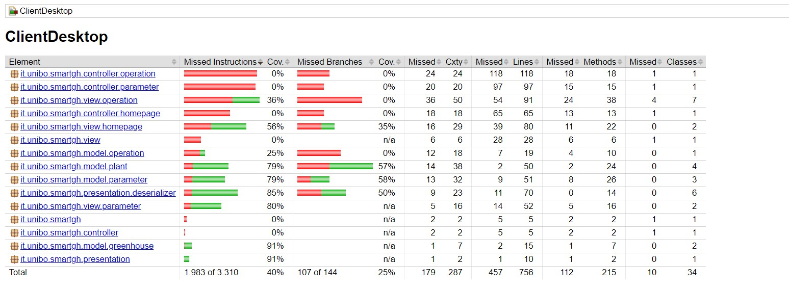
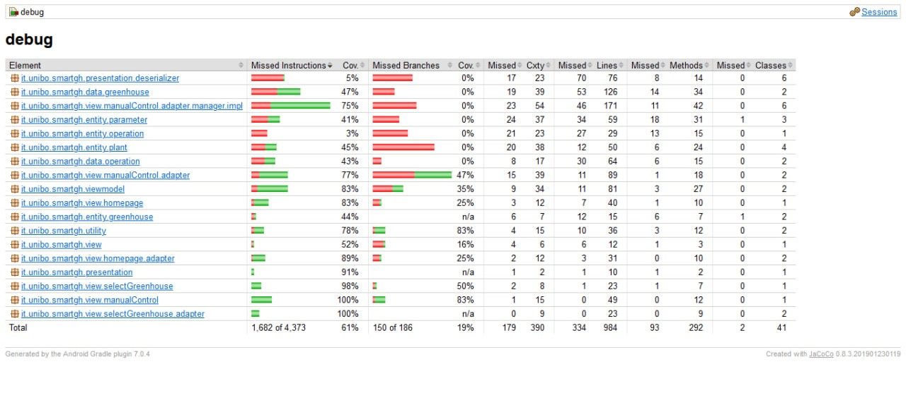

# Testing

Per verificare il corretto comportamento del sistema e l’efficacia del prodotto realizzato si è proceduto a testare le diverse componenti del sistema sia tramite test manuali, che mediante test automatici. Nelle seguenti sezioni verranno definiti con maggiore dettaglio i test realizzati.

## Testing del sistema di automazione

Per verificare il funzionamento del sistema di automazione sono stati eseguiti test manuali sull'hardware `Arduino` ed `NodeMCU ESP8266`. Inizialmente, sono stati effettuati test sui singoli sensori e attuatori del sistema per verificarne il comportamento e successivamente, i diversi programmi realizzati, sono stati integrati e testati per verificare il corretto funzionamento del sistema complessivo.

Per verificare che l’ESP inviasse e ricevesse correttamente i messaggi e attivasse gli attuatori appropriati tramite Arduino, è stato utilizzato il servizio “*broker.mqtt-dashboard.com*”, che permette di testare il sistema senza dover configurare un broker `MQTT` locale. Il servizio include una dashboard per la gestione dei messaggi `MQTT` e mette a disposizione funzionalità per la pubblicazione e sottoscrizione dei messaggi, oltre a strumenti per visualizzare i messaggi inviati e ricevuti.

## Testing del Server

Nel progetto del Server sono stati effettuati test automatici con `JUnit` per garantire la qualità del codice e verificare che tutte le funzionalità siano correttamente implementate. 

Si è cercate di testare la maggior parte dei componenti in tutti i microservizi, ottenendo una coverage complessiva del 73% con un totale di 77 test come raffigurato nella <a href="#fig1">figura 1</a>.

Inoltre, è stata utilizzata la libreria `Vert.x`, la quale include un contesto di testing per le esecuzioni asincrone. In tal modo, è possibile avviare i singoli servizi in modo asincrono e tramite l’effettuazione di richieste `HTTP` automatiche, è possibile verificare le risposte restituite dal servizio in modo semplice e agevole. 

Oltre ai test automatici, sono stati eseguiti anche test manuali per verificare il corretto funzionamento del sistema nel suo insieme, includendo la comunicazione con il sistema di automazione e con i clients.

 
[Fig 1] Coverage ottenuta per il Server

## Testing del Client Desktop

Anche per il Client Desktop sono state realizzate dei test automatici per verificare il corretto funzionamento dell'applicazione. In particolare, per la parte di *model* e *presentazione* dei dati è stato utilizzato JUnit, mentre per la parte di *view* è stato utilizzato la libreria **TestFX** che permette di testare le interfacce.

Tuttavia, siccome il sistema è distribuito, non è stato possibile testare tutte le funzionalità dell'applicazione in quanto richiede che il Server sia attivo e in esecuzione. La coverage finale ottenuta è del 40% su un totale di 21 test come è possibile vedere nella <a href="#fig2">figura 2</a>.

Infine sono stati effettuati dei test manuali sulle piattaforme Linux e Windows. Inizialmente, sono stati eseguiti dei test sulle singole pagine per verificarne il corretto comportamento, ossia verificare che le richieste effettuate al Server andassero a buon fine, ottenendo tutte le informazioni necessarie da mostrare all’utente e verificando che l’aggiornamento in *real-time*, relativo all’esecuzione di nuove operazioni o nuovi dati rilevati, funzionasse correttamente.

Successivamente, si è proceduto ad integrare le diverse schermate verificando che il comportamento complessivo dell’applicazione rimanesse invariato.

A seguito della composizione complessiva del Client si è verificato che l’interfaccia fosse responsiva alle azioni dell’utente, mantenendo inalterate le funzionalità di aggiornamento *real-time* necessarie per il monitoraggio della serra.

I test sono stati realizzati sia con Client e Server presenti sullo stesso host, che mediante l’utilizzo, per l’hosting del Server, di container Docker al fine di simulare un ambiente distribuito.

 
[Fig 2] Coverage ottenuta per il Client Desktop

## Testing del Client Mobile

Anche per il Client Mobile sono stati effettuati sia dei test automatici sia test manuali per verificare il corretto funzionamento dell'applicazione. 

Come nel Client Desktop, sono stati implementati dei *unit test* utilizzando JUnit per verificare le entità del *model* e gli aspetti di presentazione dei dati. Per quanto riguarda la *view*, invece, è stato utilizzato il *framework* di test **Espresso** che permette di eseguire i test direttamente sul dispositivo Android, fisico o emulato. L'applicazione viene compilata e installata nel dispositivo e viene lanciato il test, simulando le interazioni dell'utente e verificando il comportamento dell'applicazione. La coverage finale ottenuta è del 58% su un totale di 24 test come è possibile vedere nella <a href="#fig3">figura 3</a>.

Infine, sono stati effettuati dei test manuali, sia tramite i dispositivi Android a disposizione dei componenti del gruppo sia attraverso l’emulatore messo a disposizione da Android Studio. Come indicato per il Client Desktop, anche in questo caso i test eseguiti sono stati effettuati sia con il componente Client che con il componente Server attivi, che mediante l’utilizzo di container Docker, per l’hosting del Server, al fine di simulare un ambiente distribuito.

 
[Fig 3] Coverage ottenuta per il Client Mobile

