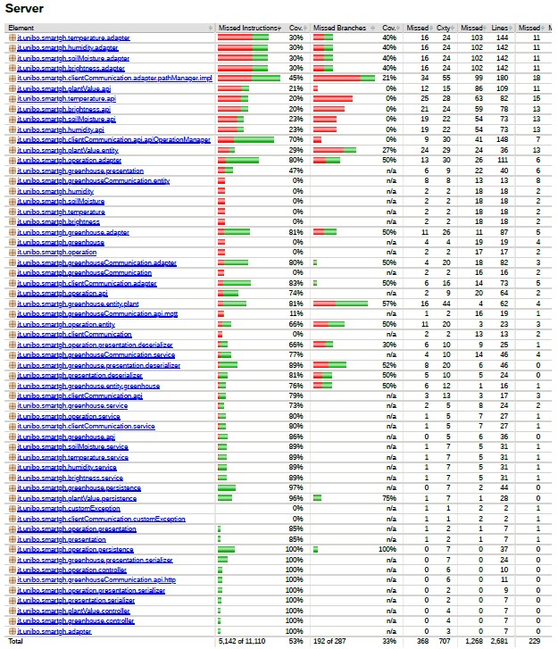

# Testing

Per verificare il corretto comportamento del sistema e l’efficacia del prodotto realizzato si è proceduto a testare le diverse componenti del sistema sia tramite test manuali, che mediante test automatici. Nelle seguenti sezioni verranno definiti con maggiore dettaglio i test realizzati.

## Testing del sistema di automazione

Per verificare il funzionamento del sistema di automazione sono stati eseguiti test manuali sull'hardware `Arduino` ed `NodeMCU ESP8266`. Inizialmente, sono stati effettuati test sui singoli sensori e attuatori del sistema per verificarne il comportamento e successivamente, i diversi programmi realizzati, sono stati integrati e testati per verificare il corretto funzionamento del sistema complessivo.

Per verificare che l’ESP inviasse e ricevesse correttamente i messaggi e attivasse gli attuatori appropriati tramite Arduino, è stato utilizzato il servizio “*broker.mqtt-dashboard.com*”, che permette di testare il sistema senza dover configurare un broker `MQTT` locale. Il servizio include una dashboard per la gestione dei messaggi `MQTT` e mette a disposizione funzionalità per la pubblicazione e sottoscrizione dei messaggi, oltre a strumenti per visualizzare i messaggi inviati e ricevuti.

## Testing del Server

Nel progetto del Server sono stati effettuati test automatici con `JUnit` per garantire la qualità del codice e verificare che tutte le funzionalità siano correttamente implementate. 

Si è cercate di testare la maggior parte dei componenti in tutti i microservizi, ottenendo una coverage complessiva del 73% con un totale di 77 test come raffigurato nella <a href="#fig1">figura 1</a>.

Inoltre, è stata utilizzata la libreria `Vert.x`, la quale include un contesto di testing per le esecuzioni asincrone. In tal modo, è possibile avviare i singoli servizi in modo asincrono e tramite l’effettuazione di richieste `HTTP` automatiche, è possibile verificare le risposte restituite dal servizio in modo semplice e agevole. 

Oltre ai test automatici, sono stati eseguiti anche test manuali per verificare il corretto funzionamento del sistema nel suo insieme, includendo la comunicazione con il sistema di automazione e con i clients.

 
[Fig 1] Coverage ottenuta per il Server

