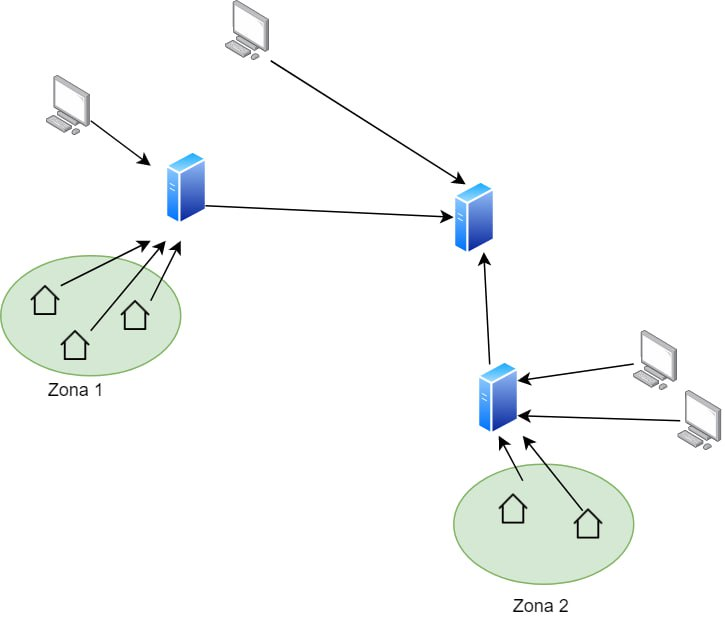
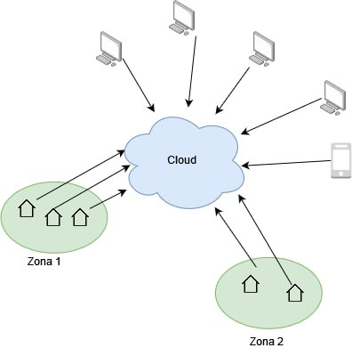

Grazie alle scelte architetturali effettuate durante la fase di progettazione, è stato realizzato un servizio che possa essere facilmente scalato e riadattato a nuove esigenze.

In particolare, si è deciso di inserire ogni micro-servizio all'interno di un apposito container Docker, come descritto nella sezione [Dettagli implementativi](https://smartgreenhouse-pc.github.io/Report/docs/implementationDetails/backend.html#docker-e-docker-compose).

[Fig 1] Container

Pertanto, come si può vedere in <a href="#fig1">figura 1</a>, sul sistema operativo viene installato il _docker engine_ all'interno del quale possono essere installati più container contenenti ciascuno un'applicazione di cui può essere effettuato il deploy, in modo indipendente dalle altre. Grazie al file `docker-compose.yaml` è possibile, in modo piuttosto pratico, gestire i propri container salvandone la configurazione di istanziamento in un unico file di configurazione in formato YAML. Nel nostro caso è stato utilizzato per poter specificare i diversi servizi di cui si compone il backend e le loro caratteristiche e per creare la rete di connessione tra i diversi container sui quali è stato effettuato il deploy dei micro-servizi, al fine di garantire il loro corretto funzionamento.

Adottando questa soluzione, è stato possibile simulare un ambiente distribuito, inoltre Docker, può essere utilizzato tramite una modalità  `swarm `, la quale dà la possibilità di creare più repliche di uno stesso servizio o insieme di servizi che potranno essere gestiti da un  `node-manage `, il quale svolge una funzione di **load-balancer**, distribuendo il carico di lavoro equamente fra i diversi servizi collegati. 

Di conseguenza, ipotizzando di dover ampliare l'applicazione per la gestione di numerose serre e sistemi di automazione, una prima soluzione che potrebbe essere adottata consiste nel replicare i micro-servizi realizzati per la parte di backend, attraverso ad esempio l'utilizzo di docker-swarm.

Pensando di dover gestire più serre dislocate in diversi punti del territorio, un'altra soluzione che si potrebbe adottare per gestire un sistema di questo tipo, sarebbe quella di posizionare dei server in punti strategici, in modo che si riesca a raccogliere le informazioni provenienti da serre che si trovino in una specifica area e rendere così l'accesso a queste informazioni più agevole a tutti gli operatori che fanno riferimento a quella zona. Le informazioni raccolte dai diversi server delle diverse zone, possono essere inserite all'interno di un Server centrale a cui i clients possono fare riferimento, qualora avessero interesse a visionare i dati relativi a serre che si trovano in altre aree.

Un vantaggio derivante da questa soluzione consiste nella velocità di accesso alle informazioni alle serre di una zona, in quanto non vi sarà la necessità di analizzare tutte le informazioni presenti nella base di dati ma solo alcune di queste, tuttavia se un Client connesso al Server di una certa zona dovesse richiedere l'accesso a informazioni relative a una serra che si trova in una zona differente, questo vantaggio verrebbe a mancare. Inoltre, il Server centrale che raccoglie le informazioni provenienti dalle diverse aree, rappresenta un punto critico della rete e per renderlo maggiormente robusto si può pensare di utilizzare delle copie di backup.

[Fig 2] Gestione di più serre dislocate sul territorio

Qualora, invece, si decidesse di propendere per una soluzione più economica si potrebbe optare per una soluzione di tipo Cloud Server; per cui il committente non sarebbe più responsabile in prima persona della gestione della componente Server, ma la delegherebbe ad un'azienda terza, che si occuperebbe di gestire il carico di lavoro, quindi della scalabilità del servizio, della sicurezza e del backup dei dati ed infine del costo relativo all'infrastruttura mettendo a disposizione un servizio di tipo **Platform as a service**. Adottando questo approccio il committente rinuncia ad un maggior controllo del servizio e all'incapacità di gestire eventuali interruzioni del servizio Cloud.

[Fig 2] Soluzione cloud computing

Per rendere il servizio più robusto si potrebbero realizzare copie di backup dei servizi che si occupano della raccolta dei dati da utilizzare al momento del bisogno. In questo caso si avrebbe a che fare con un sistema di distribuito complesso, in quanto risulterebbe necessario mantenere la consistenza dei dati in tutte le repliche.

Inoltre, occorre comunque sottolineare sempre per il fatto che si ha a che fare con un sistema distribuito, che non sarà mai possibile avere tutte è tre le proprietà di: consistenza, disponibilità e tolleranza a partizionamenti della rete. Tramite il CAP theorem; si è infatti dimostrato che di queste proprietà sarà sempre possibile averne due su tre ma mai tutte e tre contemporaneamente, quindi, ad esempio se si vuole mantenere il sistema disponibile e resistente ai partizionamenti della rete allora bisognerà rinunciare alla consistenza. In genere, la maggior parte delle soluzioni che vengono adottate nella realtà, prevedono una soluzione di tipo __eventually consistent__, dove sostanzialmente viene rilassato il vincolo della consistenza e si accetta che in alcuni momenti potrebbero esserci dei dati inconsistenti, dando priorità alla disponibilità e alla tolleranza ai partizionamenti della rete, successivamente però queste inconsistenze devono essere risolte, portando il sistema alla fine ("eventually") ad essere consistente.
