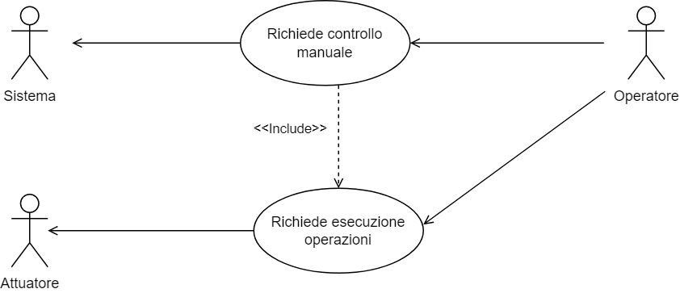

# Requisiti Utente

I requisiti utente esprimono i bisogni degli utenti e descrivono quali sono le azioni che l’utente deve poter effettuare interagendo con il sistema.

Il committente, che per il relativo progetto è stato simulato, ha richiesto un sistema che rispetti la seguente descrizione:

> Sono un produttore agricolo e mi occupo della coltivazione in serra di peperoncini.
>
> Nell'ultimo periodo, dato il crescente aumento dei costi per la produzione e le problematiche legate ai cambiamenti climatici, sarei interessato a rendere la mia serra smart, ovvero rinnovare la mia attuale serra rendendola in grado di gestire in modo automatico o semi automatico, quindi senza il costante intervento umano, le principali attività per il benessere della crescita della pianta, cercando di realizzare un’agricoltura di precisione, che mi consenta di aumentare e migliorare la produzione, riducendo i costi ad essa legati. 
>
> Le attività che mi interessa automatizzare sono: 
>
> - l'irrigazione, quindi capire quando è opportuno irrigare il terreno, così da ridurre al minimo lo spreco di acqua;
> - la regolazione della luminosità dell'ambiente, quindi, essere in grado di dare alle piante la condizione ottimale di luminosità ideale per la loro crescita;
> - regolare la temperatura in modo tale da adattarla a quella ideale per la pianta coltivata;
> - regolare l’umidità ambientale, in quanto anch'essa importante per il benessere e la salute della pianta.
>
> Questi aspetti, fino ad ora, sono stati gestiti manualmente da un operatore in base all’esperienza, ora vorrei invece, come detto prima, che venissero il quanto più possibile automatizzati.
>
> Inoltre, mi piacerebbe avere la possibilità di poter gestire la serra e i diversi sistemi presenti al suo interno dal telefono. Vorrei avere un’applicazione sul mio smartphone, che mi dia la possibilità di prendere il controllo manuale della gestione della serra e poter richiedere l’esecuzione delle operazioni dette prima, come l’irrigazione, la regolazione della luminosità della temperatura etc. Oltre a poter compiere le operazioni sulla serra, mi interesserebbe anche sapere i valori attuali dei parametri rilevati al suo interno, quali luminosità, temperatura, umidità del terreno e dell'aria.
>
> Infine, vorrei avere un’applicazione Desktop che mi consenta di vedere i dati storici, quelli attuali e le operazioni compiute dall'operatore o dal sistema in automatico e di sapere lo stato attuale della serra.

Dalla precedente descrizione possiamo rilevare i seguenti requisiti utente:

- osservare lo stato globale della serra: le informazioni della pianta, i valori attuali dei parametri rilevati e eventuali situazioni di allarme;
- compiere operazioni in modo automatico per la cura della coltivazione;
- prendere il controllo manuale del sistema per la gestione della coltivazione;
- visualizzare i dati storici raccolti in un certo arco di tempo.

A partire da ciò che è emerso dalla richiesta del committente sono stati dedotti tre casi d'uso principali.

[Fig1] Diagramma dei casi d'uso - Monitoraggio dei valori e rilevazione delle situazioni di allarme

Il diagramma visualizzato in figura 1, mostra il caso d'uso relativo al monitoraggio dei valori della pianta e della rilevazione di situazioni di allarme da parte del sistema. 
Come si può vedere, gli attori principali, in questo caso, sono tre: 

- __sensore__, il quale rappresenta una componente del sistema di automazione incaricata di rilevare un parametro vitale della pianta;
- __sistema__, che rappresenta sostanzialmente una componente che si occupa di raccogliere i dati monitorati all'interno della serra, dopo che questi sono stati raccolti dal sensore, e di analizzarli per poter rilevare eventuali situazioni di allarme, nel caso uno o più dei parametri rilevati risultino presentare dei valori critici, richiedere l'esecuzione di operazioni correttive, al fine di riportarli nei range ottimali;
- __attuatore__, che rappresenta una componente hardware, in grado di agire sull'ambiente della serra, che si occupa di attuare le operazioni correttive richieste dal sistema.

[Fig2] Diagramma dei casi d'uso - Raccolta dei dati

    

Questo caso d'uso (figura 2), invece, fa riferimento alla raccolta dei dati da parte del sistema e la loro successiva visualizzazione da parte dell'utente.

In questo caso d'uso è possibile identificare due attori: 

- __sistema__, che è incaricato di raccogliere i dati e di mostrarli successivamente all'utente;
- __operatore__, il quale interagendo attraverso le applicazioni è in grado di poter osservare i dati raccolti, memorizzati all'interno del sistema.

[Fig3] Diagramma dei casi d'uso - Richiesta del controllo manuale

  

L'ultimo caso d'uso (figura 3), ma non per importanza, si concentra sulla richiesta del controllo manuale da parte dell'operatore.
Il caso d'uso in esame prevede come attori: 

- __operatore__, che tramite l'interfaccia grafica richiede il controllo manuale della serra;
- __sistema__, che si occupa di ricevere e gestire la richiesta di presa del controllo manuale da parte dell'operatore;
- __attuatore__, che si occupa di eseguire le operazioni correttive richieste precedentemente.

I requisiti utente sono stati poi raffinati durante la sessione di Knowledge Crunching. Per i dettagli relativi a tale sessione è possibile consultare la relativa sezione all’interno del capitolo dedicato al Domain Knowledge. 