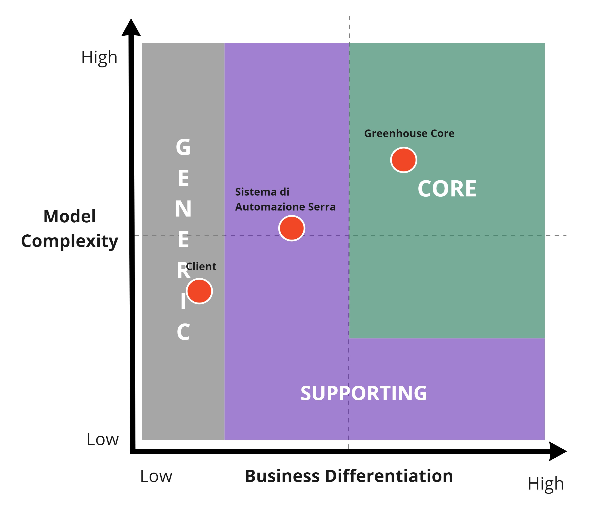

# Analisi dei sottodomini

Nel Domain Driven Design per poter meglio gestire la complessità del dominio che si vuole analizzare si consiglia di esplorare a fondo il problem-domain individuando sottodomini che siano più semplici da gestire, inoltre, è importante associare ad ognuno di questi sotto-domini individuati un’importanza: core, generic, support, in modo da aiutare gli sviluppatori a comprendere meglio quali sono gli aspetti principali su cui ci si dovrà concentrare. 

Per il problema in esame il tema di sviluppo a seguito del processo di knowledge crunching e di analisi del dominio che è stata eseguita, è riuscito ad individuare quattro sotto-domini principali:

- **Sistema di automazione serra**, il quale racchiude gli elementi presenti all’interno della serra che consentono la sua gestione in modo automatico;
- **Greenhouse core**, il quale racchiude le funzionalità principali di gestione dei dati raccolti dal sistema di automazione;
- **Client**, che comprende i diversi elementi necessari affinché possa essere effettuata un’analisi dello stato della serra e della coltivazione tramite un’applicazione Desktop e per poter monitorare e gestire la serra tramite un’applicazione Mobile;

Una volta individuati i seguenti sotto-domini, il team ha cercato di individuare l’importanza strategica che questi possiedono per il business, aiutandosi attraverso l’utilizzo dei domain charts.

 
Core Domain Chart

Come si può vedere dal grafico, il sub-domain: sistema di automazione serra, è stato classificato come **supporting domain,** in quanto, racchiude al suo interno tecnologie e sistemi che possono essere utilizzati come supporto per le funzionalità principali di gestione della serra. Inoltre, il modello che si intende realizzare non ha una complessità molto elevata e una Business Differentiation buona, ma non così alta da renderlo un core domain. 

Greenhouse core, invece, è stato identificato come **core-domain**. Il modello che si intende realizzare per questo dominio è abbastanza complesso, per di più se le funzionalità che si vogliono realizzare vengono gestite in modo opportuno si può ottenere un buon livello di business differentiation per l’organizzazione.

Infine, il sub-domain clients è stato classificato come **generic-domain**, in quanto non comprende elementi che possono contribuire a un’elevata differenziazione del business e il modello che si vuole realizzare, non è molto complesso.
